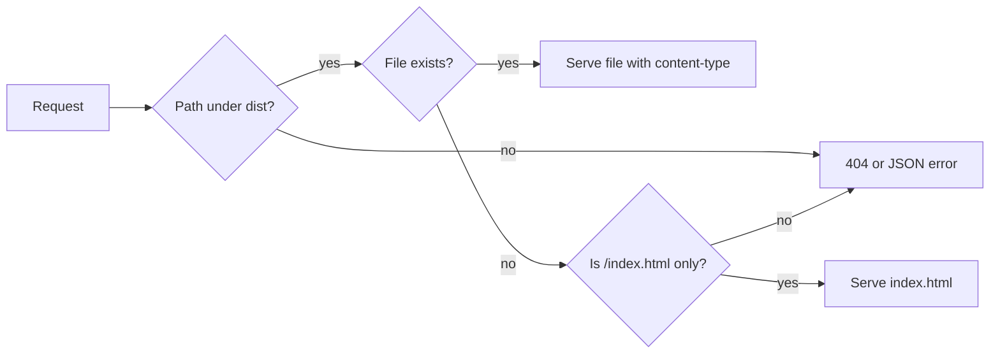
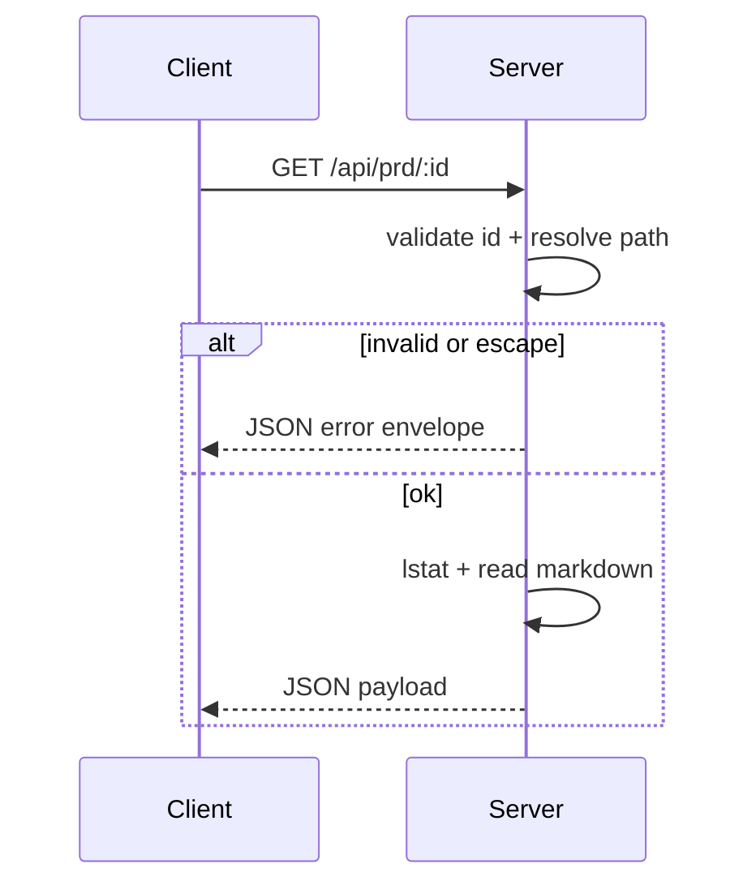
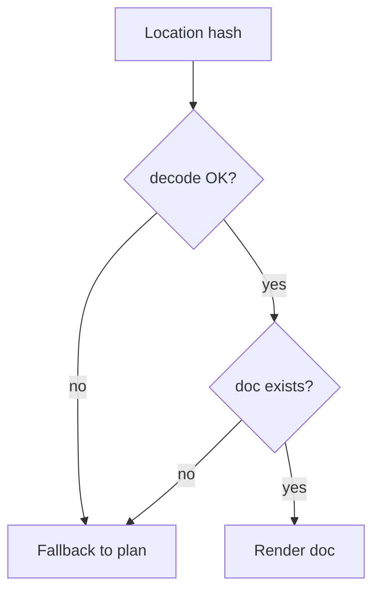
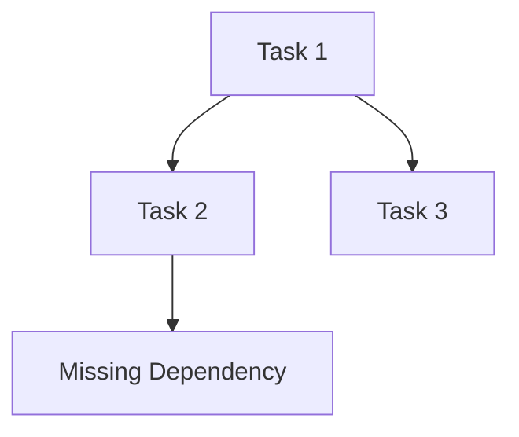

# learning

ある日、.tasks を眺めながら「安全に見せる」って何だろうと考えた。見える範囲をきっちり決めないと、意図しない場所まで見えてしまう。だから dist を配る時は実体パスを解決して、必ず dist 配下に収まっているか確認する。SPA のフォールバックも万能にせず、`/index.html` だけに絞る。無いものは無いと返す方が、API の影を踏まない。ついでに content-type は最小の地図から始めて、フォントやアイコン、ソースマップが増えたら拡張する流れがちょうど良い。

次に、.tasks のスキャナを歩かせる時の話。PRD id は信じない。`.` や `..`、区切り文字を弾き、実際の解決先が .tasks 配下にいることを確かめる。さらに lstat でシンボリックリンクの抜け道を潰す。API で失敗したら、いつも同じ JSON のエラー封筒に入れて返すと、クライアントが迷子にならない。欠けたディレクトリやファイルがあっても、同じ判断で処理するために、index を配る共通ヘルパーを使うとブレが消える。

フロントの旅は、ハッシュが信用できないところから始まる。壊れたハッシュは丁寧にデコードして、変なら安全な既定値へ戻す。PRD id は URL や select の値に入るので、区切り文字に負けないようエンコードする。memory や learning が無いなら、素直に plan 表示へ戻すとナビが安定する。

Markdown と Mermaid は気まぐれだ。DOMPurify はタスクリストのチェックボックスを黙って消すことがあるから、明示的に許可してやる。Mermaid の parse/render は失敗する時があるので、落ちないように包む。GitHub 風の見た目も、ダークテーマではテーブルや引用、コードの視認性が落ちやすいから、テーマ別に手当てが必要になる。

依存関係の図では、ノード ID を生のタスク ID にしない。UUID だと Mermaid が怒るので、安全な連番トークンに置き換える。存在しない依存は「欠落ノード」を置いて可視化する。辺は重複を消して見やすくする。

テーマ切替は UI と図の同期が肝だ。選んだテーマを localStorage に残し、html の data 属性にも反映する。切替時は Mermaid を再描画し、元のソースに戻してから描き直すと古い SVG が残らない。色は CSS 変数を Mermaid の class に渡して、テーマのトークンと同じ息をさせる。

最後に README。あれこれ詰め込むより、起動コマンドと .tasks の要件、UI の挙動を短く書く方が効く。読む人の時間を守るための省略だ。
