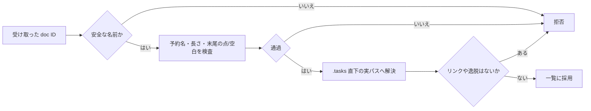
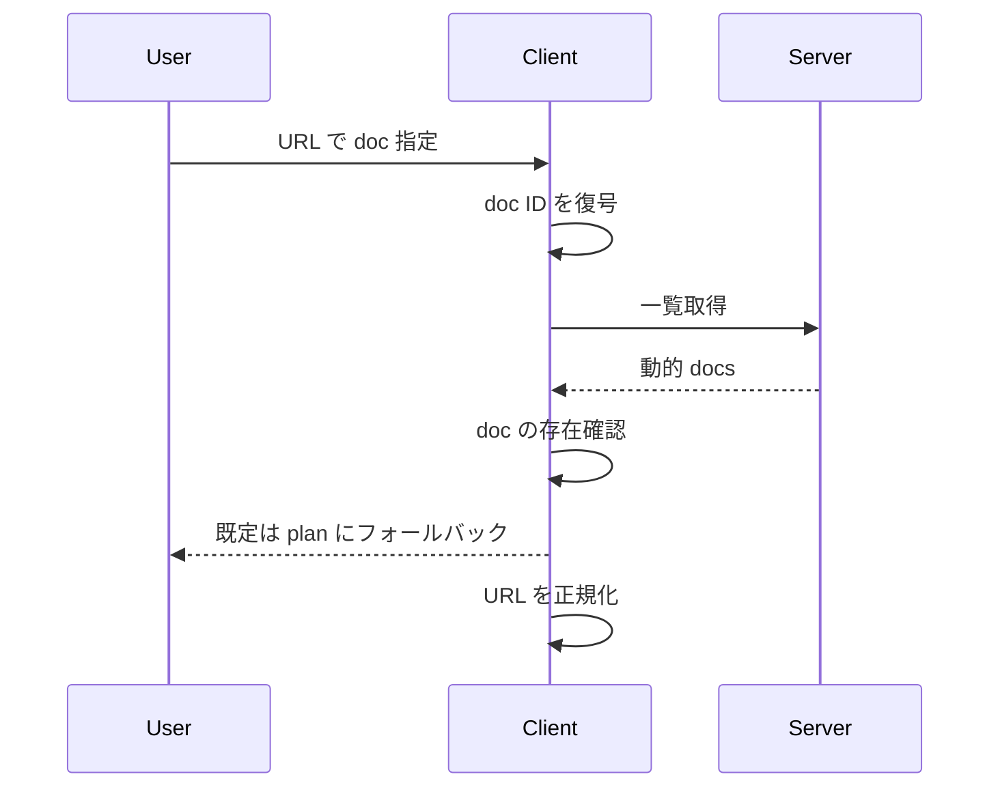
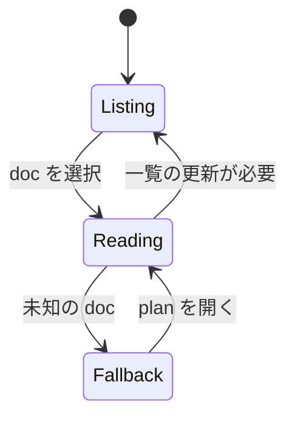

# 学びの記録

ある日、`.tasks` の奥でドキュメントが増えたり消えたりして、一覧と実体の間に小さなずれが生まれた。そこでまず、入口を整えることにした。`plan` とぶつかる名前や、末尾の点や空白、NUL、長すぎる名前を追い返し、予約名や危険な形は通さない。こうして名前の時点で道を一本に絞った。

次に、通路そのものを見張ることにした。実体の場所を実パスで確かめ、リンクの影で別の場所へ抜ける道を封じる。読み取りでは `realpath` の一致や `O_NOFOLLOW` の利用、`dev/ino` と `nlink` の確認、短い再試行で、すり替えの瞬間をかわす。一覧と読み取りの扱いもそろえ、シンボリックリンクやハードリンクの Markdown を両方から外した。

最後に、旅人であるクライアントが迷わないようにした。動的な一覧に合わせてハッシュの符号化と復号をそろえ、存在しない文書なら `plan` に戻す。URL の書き換えも一貫させ、選択は静かに正しい場所へ落ち着く。並び順は `Intl.Collator` で安定させ、大小の違いで二重に現れた影は一つにまとめた。

この流れで、一覧と実体の境界がそろい、動的な文書探索が静かに安定した。更新の反映には再読み込みが必要だという小さな決まりも、旅のリズムとして残った。
