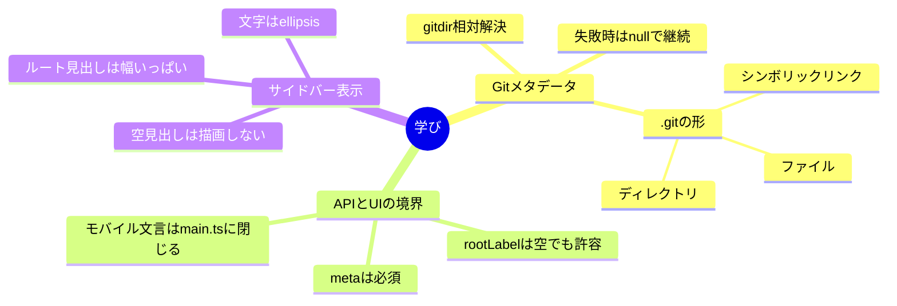

# Lessons Learned from Sidebar Root Folder and Git Branch Header

## ざっくり

.gitの形はいろいろある。だから読む側で揺れを吸収するのが正解だと再確認した。読めないときは壊さずにnullで返すほうが一覧の安定性が高い。

## APIとUI

metaを必須にしておくと状態が単純になる。rootLabelが空でもUIは@branchへフォールバックできるので、契約は固く、表示は柔らかくでいける。モバイルの文言組み立てはmain.tsに閉じておくと後で調整しやすい。

## サイドバーの見え方

ヘッダーは幅いっぱいでellipsisが効く前提にするのが手堅い。空のラベルは描画しないと余計な隙間が出ない。
