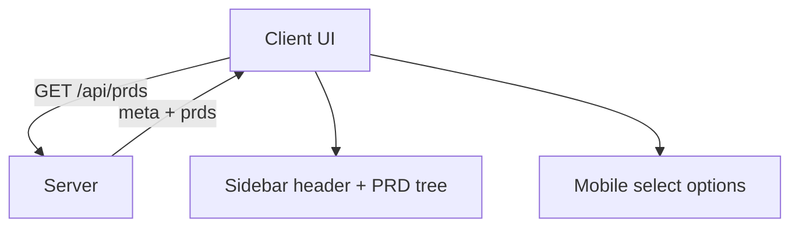

# Implementation Plan: Sidebar Root Folder and Git Branch Header

## Overview

Add a root header above PRDs in the sidebar (and mobile select) showing the parent folder name of `.tasks`, plus the current git branch when the folder is a git repository. The header always shows the folder name and appends `@branch` only when available, using a single line truncated with an ellipsis on overflow.

## Goal

The UI shows a root line formatted as `folder` or `folder @branch` depending on git availability, with PRDs nested below it, and the mobile selector includes the same hierarchy.

## Scope

- Add server-side metadata for root folder label and optional git branch.
- Update `/api/prds` response shape and client types to include that metadata.
- Render a root header above PRD groups in the sidebar with single-line ellipsis truncation.
- Update the mobile select options to include `folder @branch / PRD / doc`.

Out of scope:
- Changing PRD discovery rules or task list ordering.
- New UI screens or theme changes.
- Any git operations beyond reading the current branch.

## Prerequisites

- Familiarity with `src/server/tasks.ts` and `src/server/routes.ts`.
- Basic understanding of git HEAD file formats.
- Knowledge of sidebar and mobile select rendering in `src/client`.

## Design

### Architecture and Data Flow

- The server derives a `rootLabel` (parent folder name of the `.tasks` directory) and `gitBranch` (if detectable).
- `/api/prds` returns a new payload containing both `meta` and `prds`.
- The client stores `meta` in state and passes it to the sidebar renderer and mobile select builder.



### API Contract

`GET /api/prds` response:

```json
{
  "meta": {
    "rootLabel": "project-folder",
    "gitBranch": "feature/sidebar-header"
  },
  "prds": [
    {
      "id": "2026-01-31-00-example",
      "label": "2026-01-31-00-example",
      "docs": ["overview"],
      "progress": "not_started"
    }
  ]
}
```

- `gitBranch` is always present and set to `null` when no branch is available.

### Git Branch Detection

- Determine `projectRoot` as `dirname(realpath(tasksRoot))`.
- If `.git` does not exist in `projectRoot`, return no branch.
- If `.git` is a directory: read `.git/HEAD` and parse `ref: refs/heads/<branch>`.
- If `.git` is a file: parse `gitdir: <path>`, resolve using `path.resolve(projectRoot, gitdirValue)`, then read `<gitdir>/HEAD`.
- Trim whitespace around the `gitdir:` value and `HEAD` contents before parsing.
- If HEAD is detached (no `ref:`), return no branch to avoid misleading labels.

### UI/UX Design

- The root header uses existing sidebar typography and color tokens (muted, uppercase not required).
- The root header is always shown with `rootLabel` and optionally `@branch`.
- The root header row is a single line using `white-space: nowrap; overflow: hidden; text-overflow: ellipsis;`.
- The header appears once at the top of the sidebar content, with PRD groups below it.
- Mobile select option labels become: `rootLabel @branch / PRD / doc` or `rootLabel / PRD / doc` if no branch.
- Accessibility: keep semantic text nodes; no new interactive controls added.

## Decisions

| Topic | Decision | Rationale |
| --- | --- | --- |
| Root folder | Use the parent folder name of `.tasks` | Matches user requirement and current `.tasks` layout |
| Non-git behavior | Always show `rootLabel`; omit `@` and branch when unavailable | Keeps hierarchy consistent while honoring requirement |
| Branch display | Show only when git repo and branch ref exists | Avoid showing `@` for non-git or detached HEAD |
| Truncation | Apply single-line ellipsis to `folder @branch` | Requirement for overflow handling |
| Mobile select | Include root header in option labels | User requested matching hierarchy |
| API compatibility | Update client and server together; no backward-compatible shape | Single bundled app with internal API |

## Tasks

### B1: Add root/git metadata to PRD list API

- **ID**: `95b94d92-e278-421a-8c75-9ae6a670c6fa`
- **Category**: `backend`
- **File(s)**: `src/server/tasks.ts`, `src/server/routes.ts`

#### Description

Extend the server-side PRD listing to return both PRD data and metadata describing the root folder and optional git branch. This requires safe resolution of the `.tasks` parent folder and parsing of git HEAD data when a repository is present.

#### Details

- Add a new type (e.g., `PrdListPayload`) containing `meta` and `prds`.
- Extract `rootLabel` as the basename of the real path parent of `tasksRoot`.
- If `rootLabel` resolves to an empty string, fall back to the full `projectRoot` basename and finally to `root`.
- Implement a helper to resolve the git directory path:
  - If `.git` is a directory, use it.
  - If `.git` is a file, parse the `gitdir:` line (trimmed) and resolve with `path.resolve(projectRoot, gitdirValue)` to normalize relative/absolute paths.
- Read `HEAD` as UTF-8 (trimmed) and parse `ref: refs/heads/<branch>`.
- Return `gitBranch` only when a branch name is found; otherwise set `null`.
- Update `handleApiRequest` to return the new payload shape for `/api/prds`.
- Ensure any filesystem errors when reading `.git` fail open (no branch) rather than erroring the API.

#### Acceptance Criteria

- [ ] `/api/prds` returns `{ meta, prds }` with `rootLabel` always set.
- [ ] `rootLabel` never resolves to an empty string (falls back to `projectRoot` basename and then `root`).
- [ ] `gitBranch` key is always present and set to `null` when no branch ref exists.
- [ ] Errors reading `.git` do not break PRD listing.

### F1: Update client data model and mobile select labels

- **ID**: `a797cff9-8ce4-49f2-8d03-4a034459c452`
- **Category**: `frontend`
- **File(s)**: `src/client/api.ts`, `src/client/main.ts`

#### Description

Adapt the client to the new `/api/prds` payload shape, store the root metadata in state, and update mobile select labels to include the root header information.

#### Details

- Update API types to include `PrdListPayload` with `meta` and `prds`.
- Change `fetchPrds` to return the new payload.
- Update `state` in `main.ts` to include `rootMeta` (label + optional branch) alongside PRDs.
- Update `updateMobileSelect` to prefix labels with `rootLabel` and optional `@branch`:
  - If `gitBranch` is present: `rootLabel @gitBranch / prd / doc`.
  - Else: `rootLabel / prd / doc`.
- Do not implement backward-compatible parsing for the old `/api/prds` shape (server and client update together).
- Keep existing selection logic unchanged besides adapting to the new payload format.

#### Acceptance Criteria

- [ ] App loads PRDs successfully with the new `/api/prds` response.
- [ ] Mobile select shows root label with `@branch` when available.
- [ ] Mobile select omits `@` when `gitBranch` is missing.

### F2: Render root header in sidebar with ellipsis

- **ID**: `df95da34-6c88-4570-8b41-1ffa48a7bd91`
- **Category**: `frontend`
- **File(s)**: `src/client/components/sidebar.ts`, `src/client/styles.css`

#### Description

Introduce a root header row above the PRD list in the sidebar and ensure it truncates to a single line with ellipsis when content overflows.

#### Details

- Update `renderSidebar` signature to accept `rootLabel` and optional `gitBranch`.
- Render a top-level header element before the PRD groups:
  - Display `rootLabel @gitBranch` when branch exists.
  - Display `rootLabel` alone otherwise.
- Add CSS classes for the root header with single-line ellipsis:
  - `white-space: nowrap; overflow: hidden; text-overflow: ellipsis;`.
  - Ensure the container can shrink (`min-width: 0`) if in a flex row.
- Preserve existing PRD group status emoji layout and spacing.

#### Acceptance Criteria

- [ ] Sidebar shows a single root header above PRDs.
- [ ] Header shows `rootLabel` even when `gitBranch` is `null`.
- [ ] The header is a single line and truncates with ellipsis when long.
- [ ] PRD groups render unchanged beneath the new header.

## Verification

- **Automated**: `bun run lint`
- **Manual**:
  1. Run `bun run dev`.
  2. Open the UI and verify the sidebar header shows `folder @branch` when the parent folder has a `.git` directory.
  3. Temporarily rename `.git` to confirm the header shows only the folder name and no `@`.
  4. Check the mobile select label format matches the hierarchy.
  5. Resize the sidebar width to confirm the header truncates with an ellipsis.
