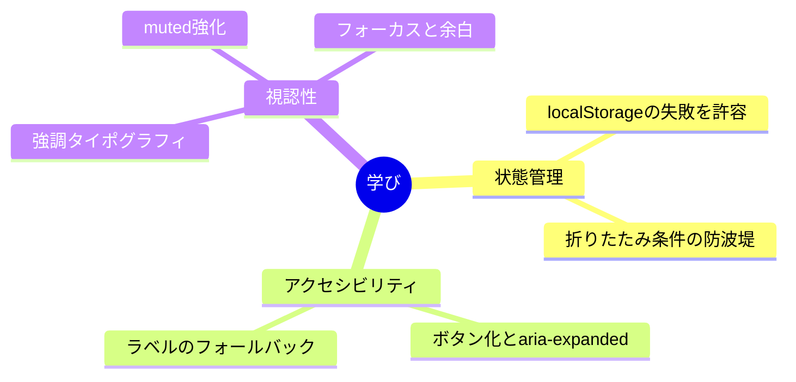

# Lessons Learned from Sidebar Root Header Collapse and Emphasis

サイドバーのルート見出しを折りたたみ可能にして、同時に存在感も上げる。見た目は小さな改修だが、裏側には状態と前提条件が絡む。まずは「折りたたみ」を導入すれば終わりだと思っていたが、実際はUIの土台が崩れる可能性があった。

最初にぶつかったのは状態の保存だ。localStorageに頼ると、プライベートブラウズや環境によっては書き込みに失敗する。そこでtry/catchで囲み、保存ができなくてもその場のトグル動作は生きるようにした。引き出しが壊れても机自体は使える、という発想だ。

次は「折りたたむ条件」を絞り込む必要があった。rootMetaが取れない状況で折りたたむと、サイドバーが空白になってしまう。そこでshouldCollapseを作り、折りたたみは前提が整った時だけに限定した。さらにラベルが空になるケースを想定して、フォールバックの見出しを置いた。これで操作の入口が消えない。

見た目の強調は単なる装飾ではなく、操作性の導線として効いた。見出しをボタン化してaria-expandedを付け、フォーカススタイルも統一する。小文字の見出しが読みやすいようにmuted系のトーンも強めた。視認性と操作性はセットで考えるべきだと分かった。

最後に残った学びは、UIの小さな切り替えほど「失敗した時の姿」を先に描くことだ。保存が落ちても動き続ける、前提が崩れても空白にしない、視認性で迷わせない。この三つを守るだけで、折りたたみはただの機能から、安心して使える仕組みに変わった。
