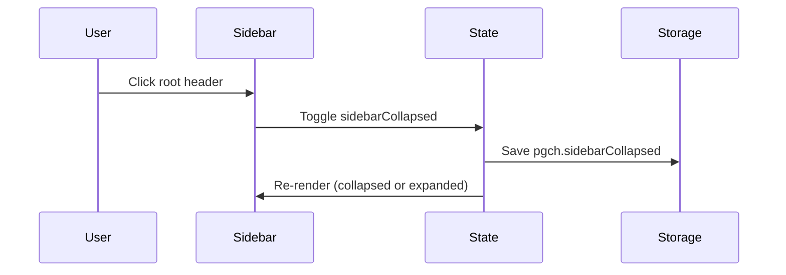

# Implementation Plan: Sidebar Root Header Collapse and Emphasis

## Overview

Add a collapsible sidebar header that hides PRD entries on click, persists the collapsed state across reloads, and visually elevates the root header so it stands out from PRD names.

## Goal

When the user clicks the root header in the sidebar, the PRD list collapses so only the parent folder/branch header remains visible. The collapsed state is restored after reload, and the header is visually prominent (larger, bolder, with a background panel).

## Scope

- Sidebar root header becomes a toggle button.
- Collapsed state is persisted in localStorage.
- Sidebar rendering updates to omit PRD groups when collapsed.
- Styling updates to emphasize the root header and add hover/focus affordance.

## Out of Scope

- Server changes or new APIs.
- Changes to mobile select behavior.
- Reordering PRDs or changing PRD content display.

## Prerequisites

- Familiarity with `renderSidebar` in `src/client/components/sidebar.ts` and the application state in `src/client/main.ts`.
- Access to browser localStorage for persistence.

## Design

### Architecture and Component Changes

- Extend `renderSidebar` signature to accept `isCollapsed: boolean` and `onToggleCollapse: () => void`.
- Render the root header as a `button.sidebar-root` with:
  - `type="button"`
  - `aria-expanded` set to `true` when expanded and `false` when collapsed
  - `title`/`aria-label` indicating it toggles PRD visibility
- If `isCollapsed` is true, render only the root header and skip PRD groups.
- Update the `refreshSidebar` call site in `src/client/main.ts` (the only `renderSidebar` call site) to pass the new arguments (mobile select remains unchanged).

### State and Persistence

- Add `sidebarCollapsed` to the client state in `src/client/main.ts`.
- Initialize from localStorage key `pgch.sidebarCollapsed` during bootstrap (fallback `false`).
- Wrap localStorage read/write in try/catch and fall back to in-memory state if storage is unavailable.
- On toggle, update state, persist to localStorage, and call `refreshSidebar()`.

### UI/UX Design

- **Typography**: Increase root header size to 15px and weight to 600.
- **Color/Panel**: Use `--panel-soft` background with `1px solid var(--border)` and radius for a card-like feel.
- **Spacing**: Add padding (e.g., `8px 12px`) for a larger click target and separation.
- **Interaction**: `:hover` and `:focus-visible` styles for clear affordance.
- **Accessibility**: Use `button` element, `aria-expanded`, and rely on default keyboard activation (Enter/Space).

### Mermaid Diagram

## Decisions

| Topic | Decision | Rationale |
|-------|----------|-----------|
| Persistence | Use localStorage key `pgch.sidebarCollapsed` | Simple client-only state that survives reloads |
| Collapse behavior | Skip rendering PRD groups when collapsed | Keeps DOM small and avoids hidden interactive elements |
| Collapsed indicator | No extra icon/state marker beyond the header styling | Keep UI minimal; collapse is communicated by the missing list |

## Risks and Mitigations

- localStorage may be unavailable (private mode or policy). Mitigation: try/catch and continue with in-memory state only.
- Root header prominence could reduce contrast in dark theme. Mitigation: keep contrast aligned with existing `--panel-soft` and `--border`.

## Tasks

### F1: Add sidebar collapse state and toggle behavior

- **ID**: `9ffba057-bfd1-412a-8c20-220623bf9c04`
- **Category**: `frontend`
- **File(s)**: `src/client/main.ts`, `src/client/components/sidebar.ts`

#### Description

Introduce a persisted `sidebarCollapsed` state and wire it to the sidebar root header so clicking the header toggles the visibility of PRD groups.

#### Details

- Add `sidebarCollapsed` to the client state in `src/client/main.ts`.
- Read `pgch.sidebarCollapsed` during bootstrap and default to `false` if unset/invalid.
- Update `renderSidebar` signature to accept `isCollapsed` and `onToggleCollapse`.
- Render the root header as a `button.sidebar-root` with `aria-expanded`, `title`, and click handler.
- When `isCollapsed` is true, do not render PRD groups.
- Persist toggle changes to localStorage and re-render sidebar after toggling.

#### Acceptance Criteria

- [ ] Clicking the root header collapses/expands the PRD list.
- [ ] Collapsed state persists after reload.
- [ ] No PRD groups are rendered while collapsed.
- [ ] `aria-expanded` matches the current expanded/collapsed state.
- [ ] Keyboard activation (Enter/Space) toggles the collapse state.
- [ ] localStorage read/write failure does not break toggling or rendering.

### F2: Emphasize root header styling and focus states

- **ID**: `d1966ec9-bb18-44c3-8676-b410b9283eba`
- **Category**: `frontend`
- **File(s)**: `src/client/styles.css`

#### Description

Make the root header visually prominent with larger typography, a background panel, and clear hover/focus affordances.

#### Details

- Update `.sidebar-root` to:
  - Increase font size and weight.
  - Use `--panel-soft` background, border, and radius.
  - Expand padding and full-width layout for a strong header presence.
- Add `:hover` and `:focus-visible` styles to highlight interactivity.

#### Acceptance Criteria

- [ ] Root header is visually more prominent than PRD titles.
- [ ] Hover/focus states are clear and accessible.
- [ ] Sidebar layout remains stable in both collapsed and expanded modes.

## Verification

- **Manual**:
  1. Run `bun run dev`.
  2. Click the root header: PRD list collapses to header only.
  3. Reload the page: collapsed state remains.
  4. Expand again and verify PRDs return.
  5. Check hover and focus styles for the header.
  6. Inspect the DOM to confirm no `.sidebar-group` elements render while collapsed.
  7. If possible, disable storage (or simulate failure) and verify toggle still works without errors.

- **Automated**: None.
