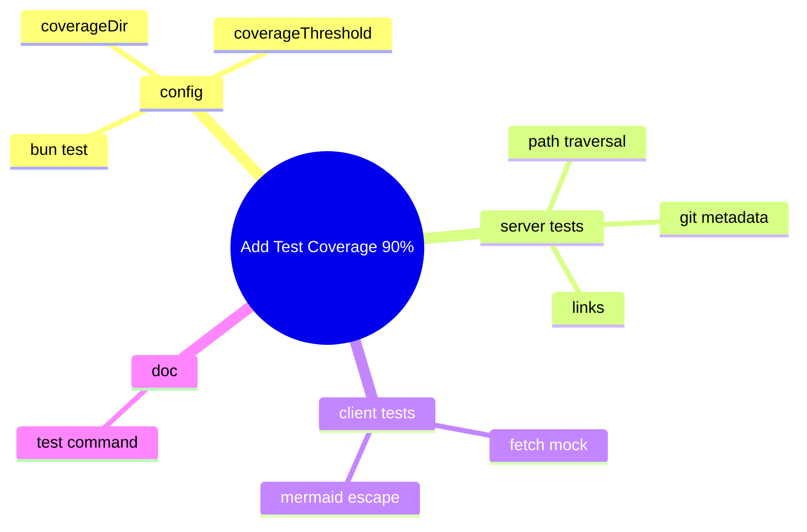

今回の実装は「90%のカバレッジ目標を現実的に守れる構成」を軸に進めた。最初に手を付けたのはBunのテスト設定で、`coverageThreshold`のキーは単数形でないと意図せず失敗することが分かり、ここで足場を固めた。`coverageDir`も`./coverage`に揃えて、成果物の扱いがぶれないようにした。

サーバー側のテストは、WindowsのURL正規化の癖があるので、相対パスの`../`ではなくドライブ付きの絶対パスを使ってパストラバーサルを踏んだ。`.git`の扱いはディレクトリ型とファイル型の両方を作り、`gitdir:`が壊れているケースも混ぜて、分岐とエラー処理が確実に通るようにした。リンク系はCIで作れない場合があるので、作れたら検証、失敗したら素直にスキップする方針にした。

クライアント側はDOMを避けたユーティリティに絞って、`fetch`を差し替えて戻す形でテストの独立性を確保した。`buildPlanGraph`はMermaidの記号に引っ張られやすいので、出力に生のラベルが残っていないことを確かめる方向で安全に確認した。

最後にテストコマンドを開発コマンド群の近くへ置いて、運用時の導線を整えた。設定→サーバー→クライアント→文書の順で進めたので、カバレッジ目標を満たすための筋道が途切れなかった。
