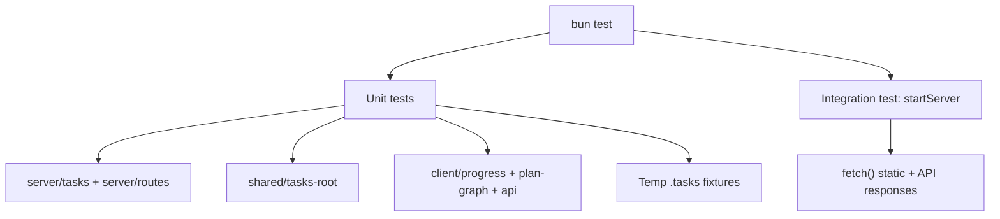

# Implementation Plan: Add Test Coverage (90% Target)

## Overview

Add Bun test coverage configuration and a set of unit/integration tests for server, shared utilities, and selected client utilities to reach a 90% coverage target.

## Goal

`bun test` completes successfully with coverage thresholds at or above 90% for lines, functions, and statements.

## Scope

- Included
  - Bun test configuration (`bunfig.toml`) and a `test` script in `package.json`.
  - Unit tests for server/shared logic: `.tasks` scanning, progress computation, safe ID handling, and API routing.
  - Lightweight client utility tests for pure functions (`progress`, `plan-graph`, `api` fetch error handling).
  - Minimal README update to document the test command.
- Excluded
  - Full DOM/UI rendering tests (layout, sidebar, main bootstrap, markdown renderer).
  - End-to-end browser tests.
  - Build pipeline changes unrelated to tests.

## Prerequisites

- Bun runtime available locally.
- Permission to add `bunfig.toml` and update `package.json` scripts.
- Agreement on coverage scope (exclude DOM-heavy client modules from coverage calculations).

## Design

Testing approach:

- Use Bun’s built-in test runner with `bunfig.toml` coverage settings.
- Place tests under `tests/` using `*.test.ts` filenames for discovery.
- Create helper utilities for temporary `.tasks` directories to test filesystem behavior safely.
- Cover server logic via direct function calls (`listPrds`, `readPlan`, `readMarkdown`, `handleApiRequest`) and one integration test for `startServer`.
- Cover client utilities that are pure or easy to mock (no DOM dependency).
- Exclude entrypoints and DOM-heavy modules from coverage to keep the 90% target realistic without browser test infrastructure.

Coverage configuration:

- Enable coverage in `bunfig.toml`.
- Set `coverageThreshold` to 0.9 for lines/functions/statements.
- Set `coverageSkipTestFiles = true`.
- Set `coverageDir = "./coverage"` and treat it as generated output (not tracked).
- Use `coveragePathIgnorePatterns` (forward-slash globs for cross-platform behavior), for example:
  - `**/dist/**`, `**/node_modules/**`, `**/example/**`
  - `**/src/server/index.ts` (entrypoint)
  - `**/src/cli.ts` (CLI entrypoint)
  - `**/src/client/main.ts`, `**/src/client/components/**`, `**/src/client/renderers/markdown.ts`

Mermaid overview:

## Decisions

| Topic | Decision | Rationale |
|-------|----------|-----------|
| Test runner | Use Bun’s built-in `bun test` | Already on Bun; no extra framework needed |
| Coverage target | 0.90 for lines/functions/statements | Matches user request |
| Coverage scope | Exclude DOM-heavy client modules and entrypoints | Avoid heavy browser test harness while still covering core logic |
| Test location | `tests/**` with `*.test.ts` | Matches Bun discovery defaults and keeps source clean |
| Integration tests | One `startServer` smoke test | Covers static file + API routing without E2E UI |
| Symlink/hardlink tests | Best-effort with skip on unsupported platforms | Windows may restrict link creation |
| PRD eligibility | `plan.md` and `plan.json` are both required by current server code | Tests align with current behavior |

## Tasks

### X1: Add test configuration and coverage rules

- **ID**: `1f1aca93-9f65-42a0-8cc6-d98f47fd582a`
- **Category**: `other`
- **File(s)**: `bunfig.toml`, `package.json`

#### Description

Introduce Bun test configuration with coverage thresholds and ignore patterns. Add a `test` script to run Bun tests consistently.

#### Details

- Create `bunfig.toml` at repo root with `[test]` settings:
  - `coverage = true`
  - `coverageReporter = ["text", "lcov"]`
  - `coverageThreshold = { lines = 0.9, functions = 0.9, statements = 0.9 }`
  - `coverageSkipTestFiles = true`
  - `coverageDir = "./coverage"`
  - `coveragePathIgnorePatterns` list per the Design section
- Confirm Bun uses forward-slash globs on Windows; adjust patterns if needed.
- Update `.gitignore` to exclude `coverage/` if not already ignored.
- Update `package.json` scripts:
  - Add `"test": "bun test"`
- Keep configuration minimal and avoid unrelated changes.

#### Acceptance Criteria

- [ ] `bun test` runs and enforces 0.9 thresholds from `bunfig.toml`.
- [ ] Coverage excludes the intended entrypoint and DOM-heavy UI modules.
- [ ] No existing scripts are removed or renamed.

### B1: Add server/shared unit tests

- **ID**: `a9140c46-3d6c-430c-8957-5ce53276fc4c`
- **Category**: `backend`
- **File(s)**: `tests/shared/tasks-root.test.ts`, `tests/server/tasks.test.ts`, `tests/server/routes.test.ts`, `tests/server/app.test.ts`, `tests/helpers/fs.ts`

#### Description

Add unit tests for shared path resolution and server task APIs, plus a light integration test for `startServer` to validate static asset handling and API routing.

#### Details

- `tests/helpers/fs.ts`
  - Helper to create temp directories under `os.tmpdir()` and clean them up.
  - Helper to create PRD folders with `plan.md`, `plan.json`, and extra docs.
- `tests/shared/tasks-root.test.ts`
  - `PGCH_TASKS_ROOT` unset → returns fallback.
  - `PGCH_TASKS_ROOT` set to relative path → resolves from `process.cwd()`.
  - Whitespace-only env value → fallback.
- `tests/server/tasks.test.ts`
  - `listPrds`:
    - Only includes PRDs with both `plan.md` and `plan.json`.
    - Computes `progress` from `plan.json` (all true → `done`, all false → `not_started`, mixed → `in_progress`).
    - Treats malformed tasks (non-objects or missing `passes`) as `false`.
    - Deduplicates docs case-insensitively and sorts with `Intl.Collator`.
    - Sorts PRDs by label using the same `localeCompare` as implementation (test with distinct labels for deterministic order).
    - Filters invalid doc IDs and reserved names (tests only for the rules currently implemented).
    - Explicit ID validation cases from current code: empty, whitespace, `.`/`..`, trailing dot/space, NUL, length > 120, reserved device names, reserved `plan`, and path separators.
    - Excludes symlinked or hard-linked Markdown files (skip if link creation unsupported).
  - `readPlan`:
    - Returns `planMarkdown` and `planJsonText` for a valid PRD.
    - Missing `plan.json` (or unreadable) should return a 404 `TasksError` consistent with current behavior.
    - Best-effort TOCTOU/atomic replace test: swap `plan.json` between stat/open to trigger retry or safe failure (skip if unstable on Windows).
  - `readMarkdown`:
    - Returns markdown for a valid doc.
    - Rejects invalid doc IDs (e.g., `plan`, `..`, path separators).
    - Rejects doc paths that resolve outside the PRD directory.
- `tests/server/routes.test.ts`
  - Non-GET requests → 405 with JSON error.
  - `/api/prds` → 200 and payload shape.
  - `/api/prds/:id/plan` → plan payload.
  - `/api/prds/:id/:doc` → markdown payload.
  - Unknown routes → 404.
- `tests/server/app.test.ts`
  - Start server with `openBrowser: false` and temp `distRoot`.
  - Use `port: 0` (ephemeral) and ensure the server is stopped after each test.
  - Create minimal `distRoot` fixture with `index.html` and `assets/app.js` to avoid relying on real `dist/`.
  - Fetch `/` to ensure index served (or fallback HTML).
  - Fetch `/assets/app.js` to verify file response and a `Cache-Control` header is set.
  - Fetch `/api/prds` to confirm API routing works through server.

#### Acceptance Criteria

- [ ] Server/shared tests cover success and error paths for listing and reading PRD data.
- [ ] Route tests verify method handling and error responses.
- [ ] Integration test exercises static file serving and API routing.
- [ ] Safety tests include invalid IDs, root boundary checks, and best-effort TOCTOU/link exclusions.

### F1: Add client utility tests (non-DOM)

- **ID**: `4e8874fe-4a79-4fe7-b882-38933b51f215`
- **Category**: `frontend`
- **File(s)**: `tests/client/progress.test.ts`, `tests/client/plan-graph.test.ts`, `tests/client/api.test.ts`

#### Description

Add unit tests for client utilities that do not require a DOM runtime.

#### Details

- `tests/client/progress.test.ts`
  - `normalizeProgress` handles `null/undefined` → `not_started`.
  - `progressToEmoji` and `progressToLabel` return expected values for each state.
- `tests/client/plan-graph.test.ts`
  - Invalid JSON → error result.
  - Missing `tasks` array → error result.
  - Valid tasks produce a graph with:
    - Correct number of nodes.
    - Missing dependency nodes labeled `Missing: ...`.
    - Escaped labels (no `<`, `>`, `&`, `]`, `[` in output).
    - `pass` vs `fail` classes based on `passes`.
- `tests/client/api.test.ts`
  - Mock `globalThis.fetch` to return JSON and verify `fetchPrds/fetchPlan/fetchMarkdown`.
  - Non-OK response returns error message from `{ error: { message } }`.
  - Non-JSON responses fallback to status-based error message.
  - `fetch` throwing an exception propagates a thrown error.

#### Acceptance Criteria

- [ ] Utility tests pass without DOM dependencies.
- [ ] `buildPlanGraph` and progress helpers are fully covered.
- [ ] API helpers handle both success and failure responses.

### D1: Document test command

- **ID**: `bc0616af-4034-4633-be11-4e6a7d8c70b2`
- **Category**: `documentation`
- **File(s)**: `README.md`

#### Description

Add a short section describing the test command and the 90% coverage target.

#### Details

- Add a `## Test` section after `Lint` (or near existing commands).
- Include `bun test` command and mention coverage threshold enforced by `bunfig.toml`.

#### Acceptance Criteria

- [ ] README lists the test command.
- [ ] Coverage threshold mention is present and concise.

## Verification

- **Automated tests**
  1. Run `bun test` — all tests pass.
  2. Ensure coverage meets thresholds (0.9 lines/functions/statements).
- **Manual checks**
  1. Verify `bunfig.toml` contains the coverage settings and ignore patterns.
  2. Confirm excluded files match intended scope.
- **Demo scenario**
  1. Create a small `.tasks` fixture in tests.
  2. Run `bun test` and confirm the server tests validate PRD listing and plan read.
