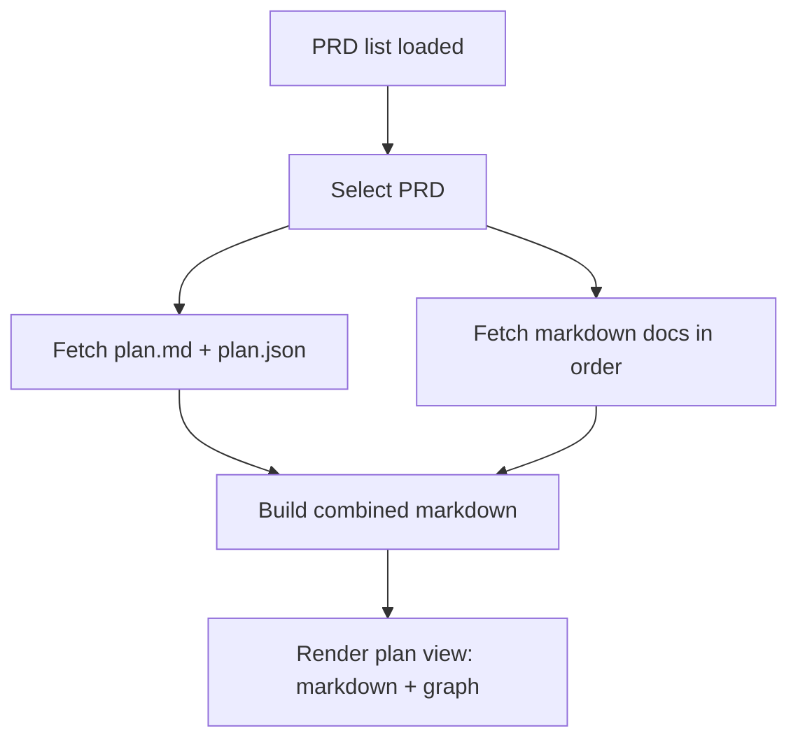

# Implementation Plan: Unified PRD Markdown View

## Overview

Show all markdown previews for a PRD on a single page in the main content area, while keeping the plan.json graph visible. The sidebar and mobile selector should list PRDs only, and selecting a PRD should render plan.md followed by other markdown files in ascending filename order as separate blocks.

## Goal

Selecting any PRD shows plan.md first, then other docs sorted by filename as separate markdown blocks alongside the plan.json graph, and the sidebar/mobile selector no longer lists individual markdown files.

## Scope

- Update client-side selection model to be PRD-only (no per-doc selection).
- Combine plan.md and other markdown contents into one rendered markdown body.
- Keep the plan.json graph on the right pane for all PRDs.
- Adjust sidebar and mobile selector UI to show PRDs only.

Out of scope:
- Server API changes or new endpoints.
- Markdown rendering library changes.
- Changes to .tasks filesystem rules or PRD discovery logic.

## Prerequisites

- Understanding of current client selection flow in `src/client/main.ts`.
- Familiarity with sidebar rendering in `src/client/components/sidebar.ts`.
- Awareness of markdown rendering in `src/client/components/plan-view.ts` and `src/client/renderers/markdown.ts`.

## Design

### Data flow

1. Fetch PRD list (`/api/prds`) as today to obtain PRD IDs and doc IDs; the client enforces ordering and de-duplication.
2. When a PRD is selected, fetch plan payload (`/api/prds/:prd/plan`).
3. Fetch each doc markdown (`/api/prds/:prd/:doc`) for the ordered doc IDs.
4. Build a list of markdown sections: plan.md first, then each doc as its own section.
5. Render the markdown sections in the left pane and the plan.json graph in the right pane using the existing plan view layout.

### UI/UX Design

- Sidebar: each PRD row is a single clickable target (name + progress emoji). No per-doc items.
- Active PRD is visually highlighted; keep status emoji aligned via `flex: 1` and `min-width: 0` on the label container.
- Mobile selector: one option per PRD (include progress emoji and the existing root prefix format when available).
- Markdown sections: render each markdown file in its own block; include a small section header with the doc ID (filename without `.md`) above each non-plan block.
- Accessibility: keep `role="img"` and `aria-label` on the emoji indicator; add `aria-current="true"` on the active PRD button.

## Decisions

| Topic | Decision | Rationale |
|-------|----------|-----------|
| “Right pane” wording | Treat the requirement’s “right pane” as the app’s main content area (not the plan graph pane), and keep the plan graph in the right split pane as today | Matches current layout: sidebar + content area with markdown/graph split |
| Hash format | Use `#/prdId` as the canonical hash; ignore any trailing doc segment if present | Keeps URLs simple while preserving backward compatibility with existing hashes |
| Legacy hash doc segment | Do not auto-scroll to a doc section when a legacy `#/prdId/doc` hash is used | Avoids extra behavior not requested and keeps implementation minimal |
| Section rendering | Render each markdown file as its own block; add a small header with `{docId}` above non-plan sections | Keeps files visually distinct without merging markdown content |
| API usage | Reuse existing plan and markdown endpoints; no new server routes | Minimizes backend change and keeps scope focused |

## Tasks

### F1: Convert selection to PRD-only and update navigation UI

- **ID**: `af22f4aa-e0c1-4244-a473-9da6f5369510`
- **Category**: `frontend`
- **File(s)**: `src/client/main.ts`, `src/client/components/sidebar.ts`, `src/client/styles.css`

#### Description

Refactor the client selection model so a PRD is the only selectable unit. Update the sidebar and mobile selector to show PRD entries only, and adjust URL hash parsing/setting to a PRD-only format.

#### Details

- Update `Selection` and related types to store only `prdId`.
- Change hash handling:
  - `parseHash` should accept `#/prdId` and treat any extra path segment as ignored (backward compatibility).
  - `setHash` should write `#/prdId` only.
- `ensureSelection` should resolve a PRD by ID and default to the first PRD when no hash exists.
- Update content mode handling to treat any selected PRD as plan mode (keep the plan layout active); use the empty state only when no PRD exists.
- Sidebar:
  - Replace per-doc buttons with a single button/row per PRD.
  - Preserve progress emoji and label alignment requirements.
  - Mark the active PRD with an `is-active` class and `aria-current="true"`.
- Mobile selector:
  - Render one option per PRD.
  - Encode only PRD ID in the option value.
  - Update the change handler accordingly.
- CSS:
  - Add styling for the new clickable PRD row and active state.
  - Remove or neutralize styles for `sidebar-items`/`sidebar-item` if unused.

#### Acceptance Criteria

- [ ] Sidebar lists PRD names only; clicking a PRD updates the hash and selection.
- [ ] Mobile selector lists PRDs only and updates selection on change.
- [ ] Hash uses `#/prdId`; old `#/prdId/doc` still resolves to the PRD.
- [ ] Active PRD is visually highlighted and exposes `aria-current="true"`.

### F2: Render unified markdown view with plan graph preserved

- **ID**: `c6eeb977-5adc-413f-a1b8-32001baec9c6`
- **Category**: `frontend`
- **File(s)**: `src/client/main.ts`, `src/client/components/plan-view.ts`, `src/client/styles.css`

#### Description

Load plan.md and all additional markdown docs for the selected PRD, render each file as its own markdown block, and keep the plan.json graph visible.

#### Details

- In `loadSelection`, start from the selected PRD’s `docs` list in `state.prds` (doc IDs are expected to be filename-without-extension, but normalize defensively):
  - Trim whitespace.
  - Strip a trailing `.md` (case-insensitive) if present.
  - Keep the normalized ID for both fetch and heading label.
- De-duplicate doc IDs case-insensitively (first occurrence wins) to match server-side expectations.
- Sort the normalized list with `Intl.Collator("en", { sensitivity: "base", numeric: true })` to match the existing server-side ordering rules.
- Fetch plan payload via `fetchPlan(prdId)`.
- Filter out any normalized docId that equals `plan` (case-insensitive) as a safety guard.
- Use the normalized docId (without `.md`) when calling `fetchMarkdown(prdId, docId)` since the API path uses doc IDs without extensions.
- Fetch all doc markdowns using `Promise.all` and `fetchMarkdown(prdId, docId)` in the sorted order.
- Build section data for rendering:
  - First section: `{ kind: "plan", id: "plan", markdown: planMarkdown }`.
  - Additional sections: `{ kind: "doc", id: normalizedDocId, markdown }` in sorted order.
- Update `renderPlanView` to accept a list of sections and render:
  - A block container per section with `content-markdown markdown-body` classes.
  - A small header element above non-plan blocks using the original doc ID string for the label.
- Add minimal styles for the section header and spacing between blocks (e.g., margin/padding) in `styles.css`.
- Keep the plan.json graph rendering unchanged.
- Protect against stale renders when selection changes mid-fetch by using a request token or comparing the latest `prdId` before rendering; ignore both success and error results from stale requests.
- If a doc fetch fails, surface an error message that indicates which document failed (use the original doc ID from the list) and render the standard error view (do not partially render).
- Ensure mermaid rendering still runs across the combined markdown.

#### Acceptance Criteria

- [ ] Markdown pane renders plan.md first, then other markdowns in ascending filename order as separate blocks on a single page.
- [ ] Plan graph (plan.json) remains visible in the right pane for every PRD view.
- [ ] If there are no extra docs, only plan.md is shown with the graph.
- [ ] Errors in fetching plan or docs show a clear error message.

## Verification

- Automated tests:
  - `bun run lint`
  - `bun run fmt`
  - `bun run typecheck`
  - `bun run test`
- Manual testing:
  1. Run `bun run dev` and open the app.
  2. Click a PRD in the sidebar and confirm the combined markdown order (plan.md then other docs).
  3. Confirm the plan graph is visible beside the markdown.
  4. Use the mobile selector (narrow viewport) to switch PRDs.
  5. Paste an old hash `#/PRD/plan` and confirm it resolves to the PRD view.
