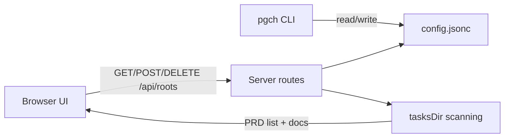

# Implementation Plan: Configurable Roots and Multi-Root Sidebar

## Overview

Introduce a JSONC configuration file that stores the list of target project directories (with optional per-root tasksDir overrides), add CLI commands to manage that list, update the server to serve multiple roots, and adjust the UI to render all configured roots with add/remove controls.

## Goal

Running `pgch` reads a JSONC config file and displays PRDs from every configured directory (using per-root tasksDir when configured). When the config list is empty, the UI shows no PRDs. CLI commands `pgch list`, `pgch add`, `pgch remove`, and `pgch config` manage the config. The sidebar renders all roots, provides copy/remove emoji buttons, and offers a toolbar to add directories.

## Scope

- Included
  - JSONC config file (read/write, default empty list)
  - CLI commands to list/add/remove roots and show config path
  - Multi-root server API and data model
  - UI updates for multi-root sidebar, toolbar add, and remove confirmation
  - Tests and minimal README updates
- Excluded
  - Changes to `.tasks` file validation rules beyond existing safety checks
  - New authentication or remote storage features

## Prerequisites

- Familiarity with Bun + TypeScript modules in `src/server/` and `src/client/`
- Basic understanding of JSONC parsing and safe path handling
- Ability to run existing verification commands (`bun run lint`, etc.)

## Design

### Configuration file

- **Schema** (JSONC):
  - `roots: Array<{ path: string; tasksDir?: string }>` where each entry is a project root directory and optional per-root tasks directory name.
  - `tasksDir?: string` global tasks directory name (relative directory name only). Defaults to `.tasks`.
  - Example:
    ```jsonc
    {
      // PiggyChick config
      "tasksDir": ".tasks",
      "roots": [
        { "path": "C:/Users/matsu/src/piggychick" },
        { "path": "C:/Users/matsu/src/another-project", "tasksDir": ".tasks-prd" }
      ]
    }
    ```
- **JSONC support**:
  - Allow `//` line comments and `/* */` block comments.
  - Allow trailing commas in arrays/objects.
  - No other JSON extensions are supported.
- **Parse errors**:
  - CLI: print a clear error and exit non-zero.
  - Server API: return a JSON error payload and show an error state in the UI.
  - Error payload format: `{ error: { code, message } }`.
- **tasksDir validation**:
  - Trim whitespace and require non-empty.
  - Must be a single directory name (no path separators, no `..`, no NUL, no trailing dot/space).
  - Default to `.tasks` when unset or blank.
  - If both global and per-root tasksDir are set, the per-root value wins.
- **Path resolution**:
  - Trim whitespace.
  - Resolve relative paths against `process.cwd()`.
  - Use `realpath` when possible to normalize and dedupe.
  - Dedupe case-insensitively while preserving order.
  - `add` rejects paths that do not exist or do not contain the effective tasks directory.
  - `listRoots` keeps configured roots even if the effective tasks directory is missing, returning an empty PRD list so the user can remove it.
- **Config location**:
  - Always `~/.config/piggychick/config.jsonc` (use the OS home directory).

### Root and PRD identity

- **Root ID**: stable hash derived from a normalized path to keep IDs stable across sessions (tasksDir changes do not change rootId).
- **Normalized path**: `realpath` if available; otherwise use the resolved absolute path.
- **Hash spec**: `sha1(normalizedPath)` hex, truncate to 12 chars; if duplicates occur in config order, append `-1`, `-2`, etc. deterministically so GET/POST/DELETE map the same root IDs.
- **PRD selection ID**: `${rootId}:${prdId}` used only for selection/hash. Actual fetch calls use `rootId` + `prdId` explicitly.

### Server API shape

- `GET /api/roots` -> `{ roots: RootSummary[] }`
- `POST /api/roots` (body: `{ path: string }`) -> updated list
- `DELETE /api/roots/:rootId` -> updated list
- `GET /api/roots/:rootId/prds/:prdId/plan`
- `GET /api/roots/:rootId/prds/:prdId/:docId`

### UI/UX design

- Keep existing dark theme, spacing, and typography.
- Sidebar shows a root header (label + branch) and PRD list per root.
- Copy and remove actions are emoji buttons: 📋 (copy), ❌ (remove).
- Add a sticky footer toolbar with a compact input and Add button.
- Confirm removal with `window.confirm` before calling the delete API.
- Persist per-root collapsed state in localStorage (try/catch guarded).
- Empty state text: `No directories configured. Use Add to include a project root.`.

### Data flow (Mermaid)



## Decisions

| Topic | Decision | Rationale |
| --- | --- | --- |
| Config location | Use `~/.config/piggychick/config.jsonc` | Consistent location across OSes |
| Config schema | Store `roots` objects with optional per-root `tasksDir` plus global `tasksDir` | Supports per-root overrides while keeping a default |
| JSONC support | Only `//` and `/* */` comments + trailing commas | Keeps custom parser small and testable |
| Root IDs | Hash of normalized path (realpath or resolved) | Stable, URL-safe, not tied to display labels |
| Env override | No env override for tasks root | Avoid confusion around naming |
| Missing tasks dir | Reject on add, but keep entry on load | Avoid silent add of invalid paths while still allowing cleanup |

## Tasks

### B1: Config utilities (JSONC, paths, normalization)

- **ID**: `cfb6050f-2280-4128-b20e-f54193274ef3`
- **Category**: `backend`
- **File(s)**: `src/shared/config.ts`, `src/shared/jsonc.ts`, `tests/shared/config.test.ts`

#### Description

Create shared utilities to resolve the config path, parse JSONC, load/write the config file, and normalize the root list.

#### Details

- Implement `resolveConfigPath()` using `~/.config/piggychick/config.jsonc`.
- Implement `parseJsonc()` by stripping comments and trailing commas before `JSON.parse`.
- `loadConfig()` returns `{ roots: [], tasksDir: ".tasks" }` when file is missing.
- `saveConfig()` writes JSONC with a short comment header.
- `normalizeRoots()` trims, resolves to absolute paths, realpath when possible, and de-dupes case-insensitively while preserving order.
- Add `normalizeTasksDir()` with validation rules and defaulting to `.tasks`.
- Add tests for parsing, defaults (including global/per-root tasksDir), path resolution, dedupe behavior, and invalid JSONC.
 - Include the config file path and parse error in thrown messages (for CLI/API display).

#### Acceptance Criteria

- [ ] Missing config file returns an empty root list.
- [ ] JSONC with comments parses correctly.
- [ ] Roots are normalized to absolute paths and de-duped.
- [ ] Invalid JSONC produces a clear error for callers.
- [ ] tasksDir defaults to `.tasks` and rejects invalid names.
- [ ] Per-root tasksDir overrides the global tasksDir.
- [ ] Tests for config utilities pass.

### B2: CLI commands and startup integration

- **ID**: `b6f43e4d-4bbc-4720-af1d-a4b9f2e4851c`
- **Category**: `backend`
- **File(s)**: `src/cli.ts`, `src/server/index.ts`, `bin/pgch.js`, `README.md`

#### Description

Add CLI subcommands for config management and update server startup to use the configured roots list.

#### Details

- Parse `process.argv` to route commands:
  - `pgch` -> start server
  - `pgch list` -> print roots (one per line)
  - `pgch add [path]` -> add path or cwd (uses global tasksDir)
  - `pgch remove [path]` -> remove path or cwd
  - `pgch config` -> print absolute config path
- Ensure `pgch add/remove` resolve relative paths from `process.cwd()`.
- Ensure `pgch add/remove` store absolute normalized paths (and optional per-root tasksDir) in the config file.
- For server startup, load roots + tasksDir from config (no env override).
- Exit with non-zero status and clear error text on config or validation errors.
 - CLI error output includes the config file path and root cause when available.

#### Acceptance Criteria

- [ ] `pgch list` shows the configured roots.
- [ ] `pgch add` and `pgch remove` update the config file.
- [ ] Added paths are stored as absolute, normalized entries.
- [ ] `pgch config` prints the config file path.
- [ ] Running `pgch` starts the server using configured roots.

### B3: Server multi-root API and tasks aggregation

- **ID**: `57a81cf9-099a-44cb-a12a-9bfd7b7c2c47`
- **Category**: `backend`
- **File(s)**: `src/server/tasks.ts`, `src/server/routes.ts`, `src/server/app.ts`, `tests/server/routes.test.ts`, `tests/server/tasks.test.ts`

#### Description

Extend server logic to handle multiple roots, expose new APIs for listing/adding/removing roots, and fetch PRDs by root.

#### Details

- Update task types to include `rootId`, `prdId`, and root metadata.
- Add `listRoots()` that loads config, computes per-root effective tasksDir paths, and returns `{ roots: RootSummary[] }` in config order.
- Add route handlers for `GET/POST/DELETE /api/roots`.
- Add routes for plan/markdown with `rootId` + `prdId` in the path.
- Keep existing safety checks (realpath, no symlinks, TOCTOU guards).
- Update tests to cover multi-root payloads, add/remove endpoints, and invalid IDs.
- Use a consistent error payload shape: `{ error: { code, message } }`.

#### Acceptance Criteria

- [ ] `GET /api/roots` returns all configured roots and their PRDs.
- [ ] `POST /api/roots` adds a root and returns the updated list.
- [ ] `DELETE /api/roots/:rootId` removes a root.
- [ ] Plan/markdown endpoints work for multiple roots.
- [ ] Server tests pass.

### F1: Client API + state for multi-root

- **ID**: `de35f41f-d8d0-4073-be71-f8bec827c100`
- **Category**: `frontend`
- **File(s)**: `src/client/api.ts`, `src/client/main.ts`, `tests/client/api.test.ts`

#### Description

Update client types and data flow to use root-based APIs and support multiple roots.

#### Details

- Replace `fetchPrds` with `fetchRoots` and add `addRoot` / `removeRoot` helpers.
- Update plan/markdown fetches to include `rootId` + `prdId`.
- Store `roots` in state and flatten PRDs for selection lookups.
- Keep hash canonicalization to a single segment using the PRD selection ID.
- Update mobile select options to include root label/branch prefix.
- Update API unit tests for new endpoints and payload shapes.

#### Acceptance Criteria

- [ ] Client loads and renders multiple roots.
- [ ] Empty root list shows: `No directories configured. Use Add to include a project root.`.
- [ ] Hash-based selection still works with the new ID format.
- [ ] Add/remove errors surface a readable message.
- [ ] Client API tests pass.

### F2: Sidebar rendering, toolbar, and emoji actions

- **ID**: `12a5b877-08d0-451b-ba6c-8d8a420d87be`
- **Category**: `frontend`
- **File(s)**: `src/client/components/layout.ts`, `src/client/components/sidebar.ts`, `src/client/styles.css`

#### Description

Render a root section per configured directory, add the toolbar for adding roots, and implement copy/remove emoji buttons with confirmation.

#### Details

- Add a sidebar footer container in layout for a toolbar.
- Render each root with a header (label + branch), plus emoji buttons:
  - 📋 copy path
  - ❌ remove (confirm before delete)
- Persist collapse state per root in localStorage (JSON map).
- Add a toolbar with an input field + Add button; on submit, call `addRoot` and refresh.
- Update CSS for toolbar, emoji buttons, and hover/focus states.

#### Acceptance Criteria

- [ ] Sidebar shows all roots with PRDs grouped under each.
- [ ] Copy button uses 📋 and remove button uses ❌.
- [ ] Remove confirmation appears and removes the root on OK.
- [ ] Toolbar can add a directory and refresh the list.

### D1: README updates for new config flow

- **ID**: `78d508e3-d76a-41e3-a9d3-4a0761e45cd0`
- **Category**: `documentation`
- **File(s)**: `README.md`

#### Description

Update CLI usage and configuration docs to reflect the new config file and commands.

#### Details

- Document `pgch list/add/remove/config`.
- Describe config file location, JSONC format, and per-root `tasksDir` overrides (manual edit).
- Note that an empty config results in no PRDs displayed.
- Keep examples for POSIX and PowerShell where relevant.

#### Acceptance Criteria

- [ ] README clearly documents new CLI commands and config behavior.

## Verification

- **Automated tests**:
  - `bun run lint`
  - `bun run fmt`
  - `bun run typecheck`
  - `bun run test`
- **Manual steps**:
  1. Run `pgch config` and confirm the path exists after `pgch add`.
  2. Run `pgch list` after adding two roots and verify both are printed.
  3. Start `pgch` and confirm the sidebar lists all roots and PRDs.
  4. Use the sidebar toolbar to add a directory and verify it appears.
  5. Click ❌ to remove a root and confirm it disappears after OK.

