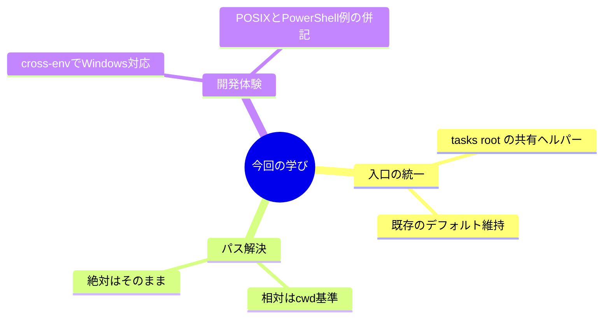

# Lessons Learned from Replace CLI args with env-based tasks root

最初の課題は、tasks root の指定が入口ごとに微妙にずれていたことだ。CLIとサーバ起動で解釈が違うと、同じ `.tasks` を見ているはずなのに別の場所を読んでしまう。ここで大事なのは、同じルールを同じコードで使うことだと腹に落ちた。

そこで `src/shared/tasks-root.ts` に寄せて、エントリーポイントが勝手に分岐しないようにした。環境変数 `PGCH_TASKS_ROOT` が無い時はフォールバックをそのまま返す。これで、サーバは従来どおり相対 `.tasks` の挙動を維持しつつ、CLI側は絶対パスの既定値をそのまま生かせる。

パス解決も小さく見えて大事な落とし穴だった。`resolve(process.cwd(), value)` を通すことで、相対パスは作業ディレクトリ基準に揃い、絶対パスはそのままになる。分岐を書かずに「どちらも受ける」実装は、意外と安心感がある。

開発体験の面では、Windows が足を引っ張りやすい。`VAR=value` のようなPOSIX書式が使えないので、`cross-env` で `PGCH_TASKS_ROOT` を渡すのが結局いちばん安全だった。ドキュメントもPOSIXとPowerShellの両方を書いておくと、無用な詰まりが消える。

最後に残った学びはシンプルだ。入口を一つのヘルパーに寄せ、パスの扱いは `resolve` に任せ、環境変数の指定と説明は複数シェル前提で書く。これだけで「動くはずなのに動かない」の回数が確実に減る。
