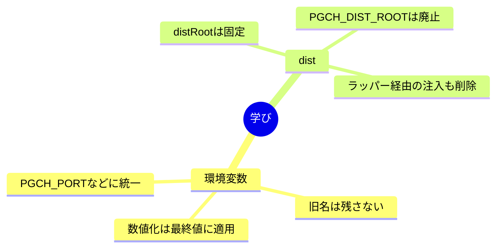

## はじまり

環境変数の名前がバラけていて、`PORT`みたいな一般名とアプリ専用の設定が混ざっていた。しかも`PGCH_DIST_ROOT`で配信先を差し替えられるのが、運用上はむしろブレの原因になっていた。なら全部PGCH\_\*に寄せて、distは固定にしよう、という話からスタートした。

## 進め方

まずはサーバー側の読み取り箇所を`PGCH_PORT`、`PGCH_OPEN_BROWSER`、`PGCH_OPEN_DELAY_MS`に統一した。ポイントは`Number()`のかけ方で、最終的に選ばれた値に対して数値化する形に揃えておくと挙動が変わらない。

次に、`PGCH_DIST_ROOT`の上書きをやめて、パッケージ同梱の`dist`だけを見るようにした。Bun起動とNodeラッパー起動の両方から同じ固定パスに着地させて、環境変数の注入も外した。

## つまずき

旧名を完全に消す方針なので、検索の仕方が少し悩ましい。`PORT`は一般名すぎて誤検知が多い。だから`process.env.PORT`や`$env:PORT`、`PORT=`みたいに「環境変数としての文脈」に絞って見た方がノイズが減る。計画の時点で検索条件を狭めておくのは正解だった。

## 学び

今回の肝は「名前の統一」と「固定化」だった。環境変数はPGCH\_\*に集約し、旧名はコードにも表示文言にも残さない。distの参照先はパッケージの`dist`に固定し、上書きやラッパー注入はやめる。こうすると起動経路が揃って、挙動が読みやすくなる。開発体験のための柔軟性より、運用の一貫性を優先するのが正解だと感じた。
