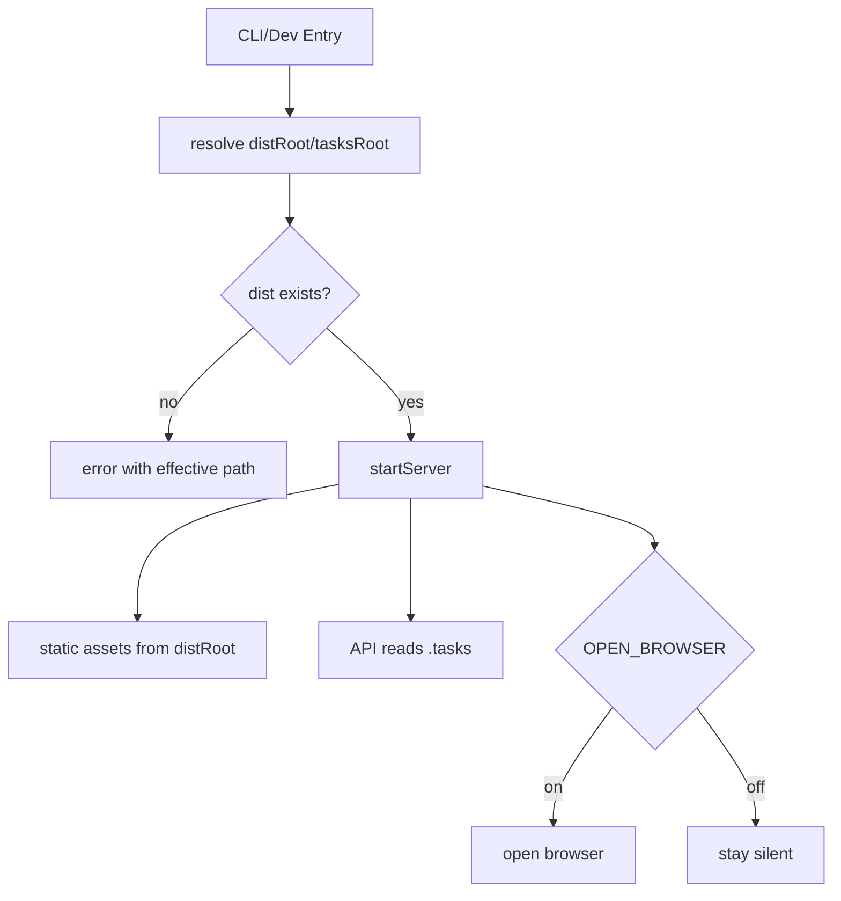
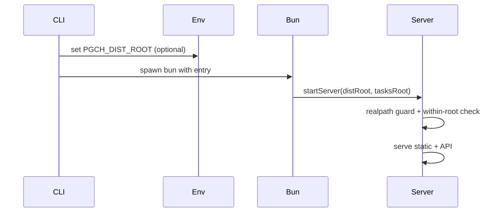
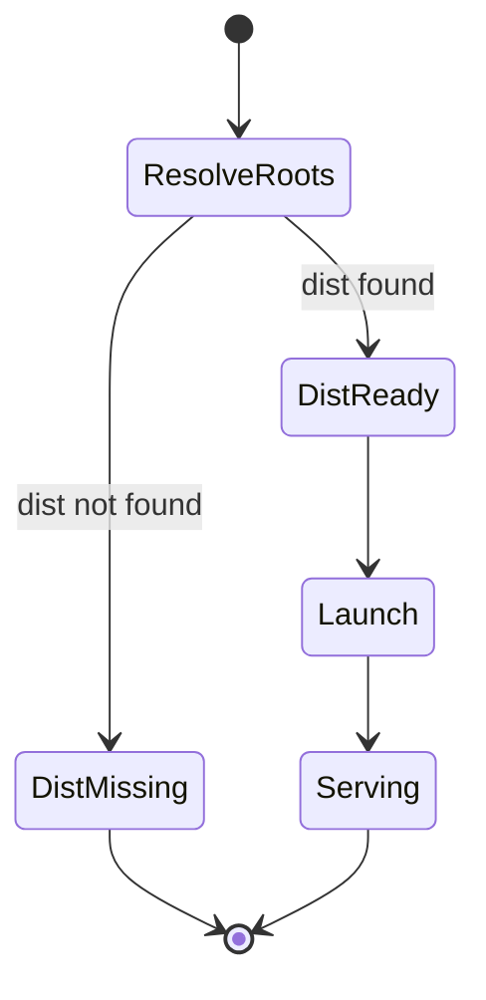

# learning

今日の話はpgch-cliの起動まわりを整える小さな冒険だ。まず気づいたのは、サーバ起動ロジックが一箇所に固まっていないと、CLIと開発用エントリで挙動がズレること。そこで起動処理をstartServerに集めて、distRootとtasksRootを引数で注入する流れにした。これでどこから呼んでも同じ安全性と同じガードが効くようになった。

次に、CLI側は「Bunがあるか」「distがあるか」をちゃんと確かめる門番にした。環境変数でdistRootを差し替えるときは、実効パスをエラーに出して迷子を防ぐのがポイントだ。OPEN_BROWSERも共有ロジック側で生かして、呼び出し元が黙ってブラウザを開くかどうかを選べるようにした。

最後は配布の話。distを含めてパッケージ化しないとCLIは素直に動かない。だからbin設定やfiles指定を揃えて、公開時に必ずbuildが走るようにしておく。これで「動くはずなのに真っ白」みたいな夜の罠が減る。

この流れで得た学びは単純だ。起動ロジックは集中させて、引数で切り替える。安全性はrealpath基準で守る。CLIは配布物の有無を早めに見抜いて、ユーザーを暗闇から引っ張り出す。こんな当たり前を丁寧に積むのが、結局いちばん効く。
