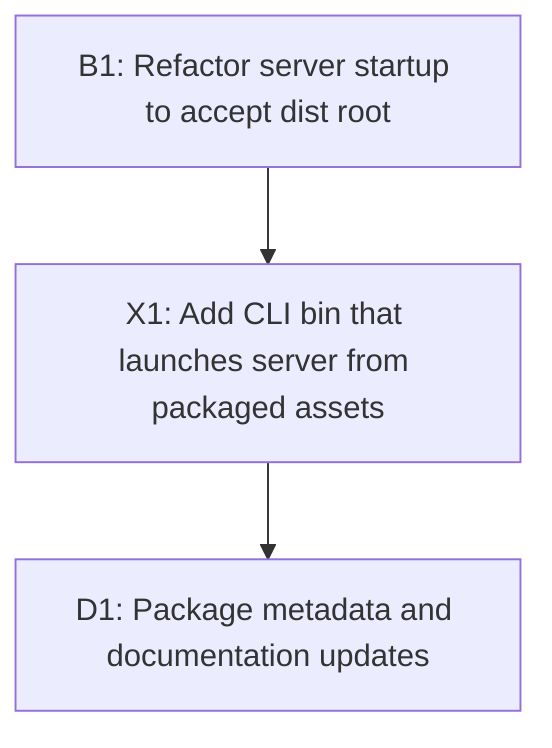

# Implementation Plan: Publish PiggyChick CLI with pgch Alias

## Overview

This plan packages PiggyChick for npm so it can be executed via `npx`/`bunx` and also exposes a short `pgch` binary when installed. It also ensures the packaged CLI can locate the bundled client assets regardless of the user's working directory. The runtime remains Bun-based.

## Goal

After implementation, users can run:
- `bunx @arenahito/piggychick` or `npx @arenahito/piggychick`
- `pgch` after installing the package globally (or via a bin shim)

The CLI serves the bundled client assets from the package and reads `.tasks` from the user's working directory by default. If Bun is not installed, the CLI should emit a clear error explaining the requirement.

## Scope

- Add a CLI entry point with the `pgch` bin name
- Refactor server startup to accept an explicit `dist` root path
- Update `package.json` for npm publish and include `dist/` in the package
- Update README usage instructions

Excluded:
- UI changes or new API endpoints
- Changes to `.tasks` format or validation logic

## Prerequisites

- Bun installed on the target machine (CLI uses Bun runtime)
- npm account with access to the `@arenahito` scope
- `bun run build` completes and produces `dist/`

## Design

### Architecture and Component Structure

- `bin/pgch.js` (new): CLI entry. Resolves package root and passes `dist` path to server startup. Runs under Node or Bun; if running under Node it spawns `bun`.
- `src/cli.ts` (new): Bun entry for CLI startup used by `bin/pgch.js`.
- `src/server/app.ts` (new): exports `startServer(options)` used by both local dev and CLI.
- `src/server/index.ts`: keeps current dev entry behavior by calling `startServer` with `process.argv`.

### Data Flow and Key Interactions

The CLI uses the user's current working directory for `.tasks`, but uses the package's `dist/` for static assets. This avoids coupling the UI assets to the user's project directory.

```mermaid
flowchart TD
    A[pgch CLI] --> B[resolve package root]
    A --> C[resolve cwd/.tasks for tasksRoot]
    A --> D{Bun runtime?}
    D -->|yes| E[startServer(options)]
    D -->|no| F[spawn bun to run src/cli.ts]
    E --> G[serve dist assets]
    E --> H[handle /api using tasksRoot]
```

### API Contracts / Interfaces

Create an explicit server startup API for reuse:

```ts
// src/server/app.ts
export type ServerOptions = {
  tasksRoot: string;
  distRoot: string;
  port?: number;
  openBrowser?: boolean;
};

export const startServer = async (options: ServerOptions) => {
  // returns Bun server instance and resolved port
};
```

### Key Behaviors and Edge Cases

- `distRoot` is resolved to a real path and guarded with `isWithinRoot` as today.
- Default `tasksRoot` is `resolve(process.cwd(), ".tasks")` (project cwd + `.tasks`).
- `pgch` accepts an optional positional `tasksRoot` argument that points to the `.tasks` directory itself (no auto-append).
- `OPEN_BROWSER=0` continues to disable auto-open.
- If `dist/` does not exist, the CLI prints a clear message that a build is required.
- If Bun is not installed, the CLI prints a clear message explaining the requirement.
- `src/cli.ts` reads `PGCH_DIST_ROOT` when provided; otherwise resolves `dist/` relative to the package root.

### UI/UX Design

No UI changes are in scope.

## Decisions

| Topic | Decision | Rationale |
| --- | --- | --- |
| Bin name | Use `pgch` as the published bin in `package.json` | Matches requested short command |
| Runtime | `pgch` uses a Node shebang and spawns `bun` when needed | Allows `npx` while keeping Bun runtime |
| Module format | Keep ESM (`type: "module"`) and ESM `bin/pgch.js` | Current package is already ESM |
| dist location | Pass explicit `distRoot` into server startup | CLI must serve packaged assets regardless of cwd |
| Install behavior | `pgch` available on PATH only for global install; local install uses `bunx pgch` | Matches npm/bun bin conventions |
| CLI args | Support positional `tasksRoot` only (no flags) | Keep CLI simple and aligned with current usage |

## Tasks

### B1: Refactor server startup to accept dist root

- **ID**: `7f5fbf24-1a1e-4b29-9d8d-faa6f0a8b8a4`
- **Category**: `backend`
- **File(s)**: `src/server/index.ts`, `src/server/app.ts`

#### Description

Extract server startup into a reusable function that can receive `tasksRoot` and `distRoot`. Preserve current dev behavior by keeping `src/server/index.ts` as a thin wrapper.

#### Details

- Create `src/server/app.ts` exporting `startServer(options)` and `ServerOptions` type.
- Move current `Bun.serve` setup into `startServer`.
- Accept `distRoot` explicitly; default in `index.ts` remains `resolve("dist")`.
- Keep `openBrowser` behavior in the shared function, with opt-out via `OPEN_BROWSER=0`.
- Ensure `handleApiRequest(request, tasksRoot)` remains unchanged.
- Maintain security checks for static file serving (`isWithinRoot`, `realpath`, `lstat`).

#### Acceptance Criteria

- [ ] `src/server/index.ts` behavior remains the same for local dev
- [ ] `startServer` can be called with any absolute `distRoot`
- [ ] No regressions in static file path safety checks
- [ ] `isWithinRoot` checks are based on the provided `distRoot`

### X1: Add CLI bin that launches server from packaged assets

- **ID**: `4f8a79c6-0c41-4f7e-a98c-f4f5d8f9e13b`
- **Category**: `other`
- **File(s)**: `bin/pgch.js`, `src/cli.ts`, `src/server/app.ts`

#### Description

Create a CLI entry point that resolves the package root, locates `dist/`, and starts the server with a `tasksRoot` based on the user's current working directory.

#### Details

- Create `bin/pgch.js` as a Node-compatible ESM entry with shebang `#!/usr/bin/env node` (works in Node or Bun).
- Use `import.meta.url` + `fileURLToPath` to derive package root and compute `distRoot`.
- Default `tasksRoot` to `resolve(process.cwd(), ".tasks")` and accept an optional positional argument to override.
- If running under Bun (`process.versions.bun`), import `src/cli.ts` and call `startServer({ tasksRoot, distRoot, port, openBrowser })`.
- If running under Node, check for `bun` in PATH; if missing, print a clear error and exit.
- If Bun is available, spawn `bun` with an absolute path to `src/cli.ts`, forwarding args and env.
- Pass `distRoot` via `PGCH_DIST_ROOT` env (so `src/cli.ts` can use it directly).
- Keep `PORT` and `OPEN_BROWSER` env handling consistent with current behavior.
- Ensure `bin/pgch.js` is included in the npm package.

#### Acceptance Criteria

- [ ] Running `node ./bin/pgch.js` starts the server and serves UI (spawns Bun)
- [ ] Running `bun ./bin/pgch.js` starts the server and serves UI
- [ ] CLI uses `resolve(process.cwd(), ".tasks")` by default for `tasksRoot`
- [ ] Clear error when Bun is missing
- [ ] Clear error when `dist/` is missing

### D1: Package metadata and documentation updates

- **ID**: `6b6a8e83-86a1-439a-9f08-7612d6a399e6`
- **Category**: `documentation`
- **File(s)**: `package.json`, `README.md`

#### Description

Update npm package metadata so it can be published and used via `npx`/`bunx`, and document the new usage patterns.

#### Details

- Set `name` to `@arenahito/piggychick` and remove `private: true`.
- Add `version`, `license`, and `publishConfig.access: "public"` for scoped publish.
- Add `bin` field mapping `pgch` to `bin/pgch.js`.
- Add `files` field to include `dist/`, `bin/`, `src/cli.ts`, and `src/server/` as needed.
- Add `prepublishOnly` script to run `bun run build`.
- Update README usage with:
  - `bunx @arenahito/piggychick` / `npx @arenahito/piggychick`
  - `bun add -g @arenahito/piggychick` then `pgch`
  - Local install note: `bun add @arenahito/piggychick` then `bunx pgch`
  - Bun requirement for runtime

#### Acceptance Criteria

- [ ] `package.json` is publishable under the `@arenahito` scope
- [ ] `dist/` is included in the published package
- [ ] README explains global and local usage clearly

## Task Dependencies



## Verification

- `bun run build` completes and `dist/` exists
- `node ./bin/pgch.js` launches the server and serves UI from `dist/`
- `bun ./bin/pgch.js` launches the server and serves UI from `dist/`
- Clear error is shown when Bun is missing or `dist/` is missing
- `.tasks` resolution uses `resolve(process.cwd(), ".tasks")` unless overridden
