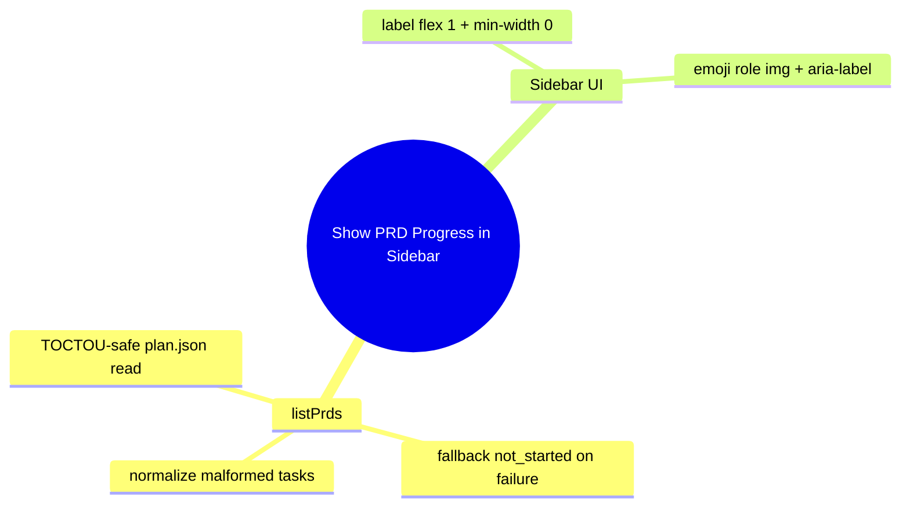

# Lessons Learned from Show PRD Progress in Sidebar

## 何が効いたか

- listPrdsのplan.json読み込みは`readTextFileWithin`に寄せるとTOCTOU対策が保てる。
- 読み込みや解析に失敗しても一覧全体を壊さず、進捗は`not_started`へ倒すと扱いが安定する。
- タスク配列に変な値が混ざっても、非オブジェクトや`passes`欠落は`false`扱いにすると計算が崩れにくい。
- サイドバーの行はラベル側に`flex: 1`と`min-width: 0`を入れると、長い名前でもステータス絵文字がずれない。
- 絵文字は`role="img"`と`aria-label`を付けると読み上げが正しくなる。

## 次に活かすこと

- 失敗時のフォールバック先を先に決めておくと、I/O由来の揺れがあってもUIの体験が一定になる。
- レイアウトとアクセシビリティは同じ場所で崩れやすいので、表示パーツごとにチェック項目を作っておくと楽だ。
