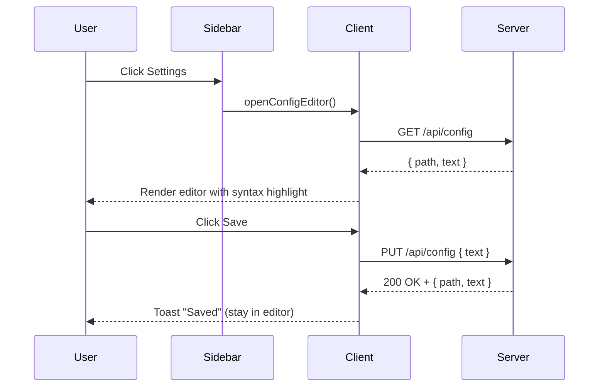

# Implementation Plan: Config File Editor View

## Overview

Add a settings editor accessible from the sidebar toolbar that loads the PiggyChick config file, provides JSONC syntax highlighting, and supports cancel/save actions with clear feedback. This includes new API endpoints for reading/saving the config text and UI updates to display the editor in the right pane.

## Goal

Users can open the config editor from the sidebar toolbar, edit the config file reported by the API (path shown in the UI) with syntax highlighting, save changes without leaving the editor (with a visible success toast), or cancel to return to the previous PRD view without saving.

## Scope

- **Included**: Server endpoints to read/write raw config text, client API helpers, editor UI (toolbar button, right pane editor, bottom action bar), JSONC syntax highlighting, toast feedback, and relevant tests.
- **Excluded**: CLI behavior changes, advanced config schema editing (form-based UI), automatic merge/conflict resolution, and prompts for unsaved changes when navigating away.

## Prerequisites

- Familiarity with `src/shared/config.ts`, `src/server/routes.ts`, and `src/client/main.ts` state flow.
- No new external dependencies (syntax highlighting implemented locally).

## Design

### Architecture and Component Structure

- **Server**
  - Add `GET /api/config` and `PUT /api/config` endpoints in `src/server/routes.ts`.
  - Implement shared helpers in `src/shared/config.ts` to read/write raw config text and validate JSONC content before saving.
- **Client**
  - Add API helpers in `src/client/api.ts` (`fetchConfig`, `saveConfig`).
  - Create a new component `src/client/components/config-editor.ts` to render the editor view (header/path, editor, footer actions, toast).
  - Update `src/client/components/sidebar.ts` to add a toolbar button that triggers the editor view.
  - Update `src/client/main.ts` to manage view mode (`plan` vs `config`), request tokens, and root list refresh after save.

### Data Flow and Key Interactions

1. User clicks **Settings** button in sidebar toolbar.
2. Client calls `GET /api/config` to fetch `{ path, text }` and displays the returned path (no hardcoded OS paths).
3. Editor renders with a textarea + highlighted overlay; scroll and input stay in sync.
4. User clicks **Save** → client calls `PUT /api/config` with `{ text }`.
5. Server validates JSONC; if valid, writes raw text (atomic replace) and returns `{ path, text }`.
6. Client shows a toast and refreshes roots (`fetchRoots`) while staying in editor view.
7. **Cancel** closes the editor and returns to the prior PRD view without saving.

### API Contracts

- **GET `/api/config`**
  - Response: `{ "path": string, "text": string }`
  - Behavior: Ensures config file exists, then returns raw text (no validation).

- **PUT `/api/config`**
  - Body: `{ "text": string }`
  - Validation: `parseJsonc(text)` + `normalizeConfig(parsed, { path: configPath })`.
  - Response: `{ "path": string, "text": string }` on success.
  - Errors: `400` for missing/non-string `text` or invalid JSONC (`config_parse_error` / `config_invalid`) with message; no file write.

### JSONC Syntax Highlighting

Implement a lightweight tokenizer in `src/client/components/config-editor.ts`:

- Scan text character-by-character.
- Track string literals (`"` and `'`), escape sequences, and line/block comments.
- Emit tokens for:
  - `comment` (`//`, `/* ... */`)
  - `string` (quoted values)
  - `number` (digits, optional sign/decimal/exponent)
  - `boolean` (`true`/`false`)
  - `null`
  - `punct` (`{ } [ ] : ,`)
- HTML-escape all token text before wrapping `...` and render in a `<pre>` beneath the textarea.
- Synchronize `scrollTop`/`scrollLeft` between textarea and pre.

### UI/UX Design

- **Layout**
  - Right pane shows a `config-editor` view with a header (title + path), editor area, and footer actions.
  - Footer includes **Cancel** (secondary) and **Save** (primary) aligned right.
- **Typography & Color**
  - Use `JetBrains Mono` for editor text.
  - Extend existing palette with token colors (e.g., string = `--md-code`, comment = `--muted`, number = `--md-h4`).
- **Interactions**
  - On open: focus textarea.
  - On save: disable buttons while saving; show success toast via `role="status"` + `aria-live="polite"`.
  - On error: show error toast via `role="status"` + `aria-live="assertive"` and keep editor text intact.
  - On cancel: close editor without saving and return to PRD view.
- **Accessibility**
  - Toolbar button has clear label (`Settings`) and `aria-label` if using an icon.
  - Textarea uses `aria-label="Config file"`, `spellcheck="false"`.

## Decisions

| Topic | Decision | Rationale |
| --- | --- | --- |
| Config route | Use `/api/config` GET/PUT and display API-provided path | Avoid OS-specific assumptions and keep UI accurate. |
| Save validation | Parse JSONC and normalize config before writing | Prevent invalid config from breaking the app; reuse existing validation logic. |
| Syntax highlighting | Custom JSONC tokenizer + overlay pre/textarea | Avoid new dependencies and keep bundle size minimal. |
| Post-save refresh | Re-fetch roots after successful save | Reflect updated roots/tasksDir immediately without closing editor. |
| Unsaved changes | No leave-warning | Requirement only specifies cancel behavior; keep scope minimal. |

## Tasks

Task order/dependencies: **B1 → F1 → F2**.

### B1: Add config text helpers and API endpoints

- **ID**: `02ba8f2b-9bf7-4769-8e51-83aedb31a33f`
- **Category**: `backend`
- **File(s)**: `src/shared/config.ts`, `src/server/routes.ts`, `tests/server/routes.test.ts`

#### Description

Implement server support for reading and writing the raw config text. Introduce shared helpers to ensure the config file exists, read raw JSONC text, validate on save, and write new content. Expose the functionality via `/api/config` and add route tests.

#### Details

- Add `readConfigText(path?)` and `writeConfigText(text, path?)` in `src/shared/config.ts`.
  - `readConfigText` calls `ensureConfigFile`, then `readFile` and returns text.
  - `writeConfigText` validates by parsing JSONC and calling `normalizeConfig` with `{ path }`, then writes via temp file + rename for atomicity.
- In `src/server/routes.ts`, add `/api/config` handling:
  - `GET`: return `{ path, text }`.
  - `PUT`: parse JSON body, validate `text`, write file, and return `{ path, text }`.
  - Return `400` for missing/non-string `text` or validation errors.
- Update `tests/server/routes.test.ts` to cover:
  - GET returns text and path.
  - PUT saves valid text.
  - PUT rejects invalid JSONC without writing.
  - PUT rejects non-string `text`.
  - Existing file content remains unchanged when save fails.

#### Acceptance Criteria

- [ ] `GET /api/config` returns `200` with `{ path, text }`.
- [ ] `PUT /api/config` writes config only when validation passes.
- [ ] Invalid JSONC returns `400` with a clear error code/message.
- [ ] Route tests cover the new behavior.

### F1: Add config editor view and wiring

- **ID**: `49b7af1e-026f-4ff2-90b7-0e1cc603e064`
- **Category**: `frontend`
- **File(s)**: `src/client/api.ts`, `src/client/components/sidebar.ts`, `src/client/components/config-editor.ts`, `src/client/main.ts`, `tests/client/api.test.ts`

#### Description

Create the UI for the config editor and connect it to the new API endpoints. Add the toolbar button to open the editor, manage view state, and keep the PRD selection intact while editing. Ensure save/cancel behaviors and root refresh logic are wired.

#### Details

- Add `fetchConfig()` and `saveConfig(text)` to `src/client/api.ts` returning `{ path, text }`.
- Extend `renderSidebar` to render a toolbar button (e.g., "Settings") that calls a new `onOpenConfig` callback.
- Create `renderConfigEditor` in `src/client/components/config-editor.ts`:
  - Parameters: container, config path, text, callbacks for `onCancel` and `onSave`, and `onChange`.
  - Render header (title + path), editor area, and footer buttons.
  - Provide a toast container for save feedback (but actual token styling in F2).
- Update `src/client/main.ts`:
  - Track `viewMode: "plan" | "config"` and config editor state (`text`, `path`, `isSaving`).
  - Add request token `configRequest` to avoid stale responses when opening editor.
  - `openConfigEditor()` loads config text and renders editor view.
  - `saveConfig` triggers PUT, shows toast, and refreshes roots via `fetchRoots`, but stays in editor view.
  - `cancel` returns to plan view and calls `loadSelection()`.
  - On GET/PUT failure, show error toast and keep editor text intact.
  - If initial GET fails, render a right-pane error message with Retry/Cancel actions instead of switching away.
  - If `fetchRoots` fails after save, keep the editor open and show a warning toast (save still succeeded).
- Update `tests/client/api.test.ts` to cover `fetchConfig` and `saveConfig` URLs/methods.

#### Acceptance Criteria

- [ ] Sidebar toolbar includes a Settings button that opens the config editor.
- [ ] Editor loads config text from `/api/config` and displays the file path.
- [ ] Save calls `/api/config` with updated text and refreshes root list.
- [ ] Cancel closes the editor without saving.
- [ ] Errors (load/save) show an error toast without clearing edits.
- [ ] GET failure renders an editor error state with retry/cancel actions.
- [ ] Client API tests cover new helpers.

### F2: Implement JSONC highlighting, toast, and editor styles

- **ID**: `0e081d56-b1d1-467c-bbc7-a56666136057`
- **Category**: `frontend`
- **File(s)**: `src/client/components/config-editor.ts`, `src/client/styles.css`

#### Description

Add syntax highlighting, toast feedback, and full editor styling so the editor feels native to the existing UI while remaining accessible.

#### Details

- Implement JSONC tokenizer and HTML rendering for highlighted overlay.
- Sync scrolling between textarea and overlay; update highlight on input (use `requestAnimationFrame`).
- Add toast styles with variants for success/error/warning (e.g., `.config-toast--success`, `.config-toast--error`, `.config-toast--warning`) and timed dismissal.
- Style editor layout, header, footer buttons, and token colors.
- Add `app-content--config` class rules to ensure the editor fills the right pane and manages overflow.

#### Acceptance Criteria

- [ ] JSONC text is syntax highlighted while editing.
- [ ] Editor scroll stays in sync between textarea and highlight layer.
- [ ] Save displays a toast message without leaving the editor view.
- [ ] Highlight output is HTML-escaped before rendering.
- [ ] Editor layout is responsive and matches the dark theme.

## Risks

- **Large config files**: Full re-tokenization on each input could be slow. Mitigation: throttle with `requestAnimationFrame` (and consider future size-based optimizations if needed).
- **Overlay editor quirks**: Textarea + `<pre>` overlays can desync with IME/selection. Keep behavior simple and test on at least one IME scenario.

## Verification

- **Automated tests**:
  - `bun test`
- **Manual testing steps**:
  1. Open the UI and click **Settings** in the sidebar toolbar.
  2. Confirm the config path and contents load.
  3. Edit the JSONC, click **Save**, and observe a success toast.
  4. Verify roots list updates if config changes.
  5. Click **Cancel** and ensure the PRD view returns without saving changes.
  6. Try saving invalid JSONC and confirm an error toast/message.

