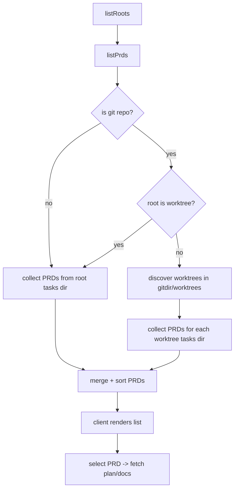

# Implementation Plan: Git worktree PRD listing

## Overview

Include PRDs from git worktree directories alongside root PRDs, and visually mark worktree PRDs with a single-line worktree label under the PRD name.

## Goal

When a configured root is a git repository, PRDs found under each worktree's tasks directory are listed together with root PRDs. Worktree PRDs show the worktree name under the PRD label, and selecting them loads the correct plan/docs. If the configured root itself is a worktree, do not scan other worktrees.

## Scope

- Included:
  - Discover git worktrees from the root repository and list their PRDs together with root PRDs.
  - Encode worktree PRDs with unique IDs and resolve them when reading plans/docs.
  - Display worktree name under PRD title in the sidebar list; truncate with ellipsis when needed.
  - Surface worktree label in the mobile selector for clarity.
- Excluded:
  - Changing config format or tasks root behavior.
  - Any git operations beyond reading local metadata.

## Prerequisites

- Familiarity with git worktree metadata stored in `.git/worktrees/*`.
- Existing safe file IO helpers in `src/server/tasks.ts`.

## Design

### Architecture and data flow

### Worktree discovery

- Resolve the git directory via existing `.git` handling (directory, symlink, or `gitdir:` file). The returned `gitDir` is the resolved git metadata directory (not the `.git` file path).
- Detect “root is worktree” when `.git` is a file whose resolved gitdir path contains a `worktrees` segment.
- If root is not a worktree, read `gitDir/worktrees/*/gitdir` files to determine worktree `.git` paths, then derive worktree root paths.
  - Resolve relative paths in `gitdir` files relative to the `gitdir` file location (same rule as the existing `.git` file parser).
- Validate each worktree root path:
  - Must exist and be a directory.
  - Use `realpath` to de-duplicate and avoid self-reference to the main root.
  - If worktree discovery fails (missing dir, unreadable file, invalid format), fall back to listing root PRDs only.
  - Per-entry failures (missing `gitdir`, invalid path, non-directory) are skipped while continuing other entries.
  - If `gitDir/worktrees` cannot be read, return an empty worktree list.

### Worktree name normalization

Given `rootDirName` (basename of project root) and `worktreeDirName` (basename of worktree path):

1. If `worktreeDirName` starts with `rootDirName` (case-insensitive), remove that prefix.
2. Remove leading characters until the first ASCII alphanumeric `[A-Za-z0-9]`.
3. If the result is empty, fall back to the original `worktreeDirName`.

The resulting string is used for display and stored as `worktree.label`.

### PRD identity encoding

- Root PRDs keep `id = prdDirName`.
- Worktree PRDs use an encoded ID: `wt:{worktreeId}:{prdDirName}`
  - `worktreeId` is a stable short hash of the worktree path (12 hex chars, same SHA-1 scheme as root IDs).
  - Parsing uses the `wt:` prefix to avoid ambiguity with normal PRD names.
- When reading plans/docs, decode the PRD ID to `prdDirName` and optional `worktreeId` to resolve the correct tasks root.
  - Client URLs always use `encodeURIComponent`, so `wt:` IDs remain valid path segments.

### Sorting

- Use `Intl.Collator("en", { sensitivity: "base", numeric: true })`.
- Sort by `prd.label`, then by `worktree.label` (empty string for root PRDs), then by `worktree.id` for stable ordering.

### UI/UX design

- Sidebar PRD entry becomes a two-line stack:
  - Line 1: PRD title (uppercase, existing styling).
  - Line 2 (worktree only): worktree label (muted, smaller, single-line ellipsis, no uppercase transform).
- Keep the label container with `flex: 1` and `min-width: 0` to align status icons.
- Mobile selector appends worktree label in parentheses, e.g. `My PRD (feature-01)`.

## Decisions

| Topic | Decision | Rationale |
|-------|----------|-----------|
| Worktree label source | Use worktree directory basename with root prefix and leading non-alnum trimming | Matches user-provided rules and remains stable across UI |
| PRD ID encoding | `wt:{worktreeId}:{prdDirName}` prefix format | Unique IDs without changing URL structure or client hash semantics |
| Mobile display | Append worktree label in parentheses | Mobile view lacks multi-line rows, needs explicit disambiguation |
| Worktree label purpose | `worktree.label` is display-only (not used for lookup) | Avoids coupling API identity to UI formatting |

## Risks

- Large numbers of worktrees increase IO cost during listing; mitigate by failing fast and falling back to root-only on errors.
- Short hash `worktreeId` collisions are theoretically possible; behavior will be first-match in deterministic worktree discovery order (sorted by entry name). The risk is low for typical path counts.

## Tasks

### B1: Discover worktrees and include their PRDs in list

- **ID**: `bc1aea94-c4f1-4ba0-a732-10476b745e2c`
- **Category**: `backend`
- **File(s)**: `src/server/tasks.ts`

#### Description

Add git worktree discovery and extend PRD listing so worktree PRDs are merged with root PRDs. Attach optional worktree metadata and encode IDs for worktree PRDs.

#### Details

- Add types:
  - `WorktreeInfo` (internal): `{ id: string; path: string; label: string }`
  - Extend `PrdSummary` with optional `worktree?: { id: string; label: string }`
- Add helpers:
  - `resolveGitInfo(projectRoot)` returning `{ gitDir: string | null; isWorktree: boolean }`.
  - `listGitWorktrees(projectRoot, gitDir)` returning `WorktreeInfo[]` using `gitDir/worktrees/*/gitdir`.
  - `normalizeWorktreeLabel(rootDirName, worktreeDirName)` implementing the trimming rules.
  - `encodeWorktreePrdId(worktreeId, prdId)`.
- Refactor existing PRD scan into `collectPrds(tasksRoot, { worktree })` so it can be reused for root and worktrees.
- For each worktree:
  - `tasksRoot = resolve(worktree.path, tasksDirName)` (tasksDirName from the configured root tasks dir).
  - Collect PRDs; set `id` via `encodeWorktreePrdId`, `label` as PRD dir name, and `worktree` metadata.
- Merge all PRDs (root + worktrees) and sort using the collator and tie-breakers described above.
- Ensure all existing safety checks remain (realpath boundary checks, symlink/hard-link filtering).
- Preserve existing `prdSort` behavior by applying the same sort order after merging worktree PRDs.

#### Acceptance Criteria

- [ ] When the configured root is a git repo (and not itself a worktree), PRDs under each worktree tasks dir appear in the list together with root PRDs.
- [ ] Worktree PRDs include `worktree.id` and `worktree.label`, and use an encoded `id`.
- [ ] Sorting is stable and consistent with the existing collator rules.
- [ ] If the root is a worktree, no additional worktrees are scanned.
- [ ] If worktree discovery fails or is incomplete, root PRDs still list normally without throwing.

### B2: Resolve worktree PRD IDs when reading plans/docs

- **ID**: `395ad411-5eb1-4f3e-bcc4-2ce04cc8e5af`
- **Category**: `backend`
- **File(s)**: `src/server/tasks.ts`

#### Description

Make `readPlanByRoot` and `readMarkdownByRoot` work with encoded worktree PRD IDs by resolving the correct tasks root before reading files.

#### Details

- Add `parsePrdIdentity(prdParam)` that returns `{ prdId: string; worktreeId: string | null }`:
  - If `prdParam` starts with `wt:`, split into `worktreeId` and `prdId`.
  - Validate `worktreeId` as exactly 12 hex chars, and ensure `prdId` passes `isSafePrd`.
- Add `resolveTasksRootForPrd(root, prdIdentity)`:
  - For root PRDs: `resolveTasksDirPath(root.path, root.tasksDir)`.
  - For worktree PRDs: use `listGitWorktrees` to find matching `worktreeId`, then compute its tasks root.
  - If root is a worktree or `worktreeId` cannot be resolved, throw `TasksError("not_found", 404, "PRD not found")`.
- Use the decoded `prdId` in `readPlan` / `readMarkdown` so safe PRD validation applies to real folder names.

#### Acceptance Criteria

- [ ] Encoded worktree PRD IDs load plan/doc content from the correct worktree tasks dir.
- [ ] Invalid or unknown `worktreeId` returns 404 without leaking filesystem details.
- [ ] Root PRD IDs still resolve as before.

### F1: Show worktree label under PRD name in sidebar

- **ID**: `74aa0776-d324-44c9-8c1a-c9928f5fed2b`
- **Category**: `frontend`
- **File(s)**: `src/client/api.ts`, `src/client/components/sidebar.ts`, `src/client/styles.css`

#### Description

Update client types and sidebar rendering to display a worktree label under the PRD title, using ellipsis when the label overflows.

#### Details

- Extend `PrdSummary` in `src/client/api.ts` with `worktree?: { id: string; label: string }`.
- In `renderSidebar`, replace the single-line label with a two-line container:
  - Create a wrapper (e.g. `.sidebar-prd-text`) with `flex: 1` and `min-width: 0`.
  - Add `.sidebar-prd-title` for the PRD name (uppercase styling, single-line ellipsis).
  - If `prd.worktree` exists, add `.sidebar-prd-worktree` with muted color and ellipsis.
- Update CSS to define the new classes and remove the previous multi-line clamp that would hide the worktree line.
- Keep the status icon alignment rule by ensuring the label wrapper remains the flex item.

#### Acceptance Criteria

- [ ] Worktree PRDs show a second line with the worktree label beneath the PRD title.
- [ ] The worktree label truncates with ellipsis if it exceeds available width.
- [ ] Status icons remain aligned across rows (label wrapper has `flex: 1` and `min-width: 0`).

### F2: Clarify worktree PRDs in mobile selector

- **ID**: `af7ff448-9425-4f89-a612-28bd3c2c0009`
- **Category**: `frontend`
- **File(s)**: `src/client/main.ts`

#### Description

Include the worktree label in the mobile selector text so worktree PRDs are identifiable when the sidebar is hidden.

#### Details

- When building option text in `updateMobileSelect`, append `(${worktree.label})` for worktree PRDs.
- Keep existing root prefix and progress emoji formatting.

#### Acceptance Criteria

- [ ] Mobile select entries for worktree PRDs include the worktree label in parentheses.
- [ ] Non-worktree PRDs retain their current label format.

## Verification

- **Automated tests**:
  - `bun run lint`
  - `bun run fmt`
  - `bun run typecheck`
  - `bun run test`

- **Manual testing**:
  1. Configure a git repo with at least one worktree containing a `.tasks` directory.
  2. Confirm PRDs from root and worktree appear in a single list.
  3. Verify worktree PRDs show the worktree label line and truncate with ellipsis when long.
  4. Select a worktree PRD and confirm its plan loads from the correct worktree.
  5. Open the mobile selector and confirm worktree labels appear in parentheses.
  6. Use a root that is itself a worktree and verify no other worktrees are listed.
