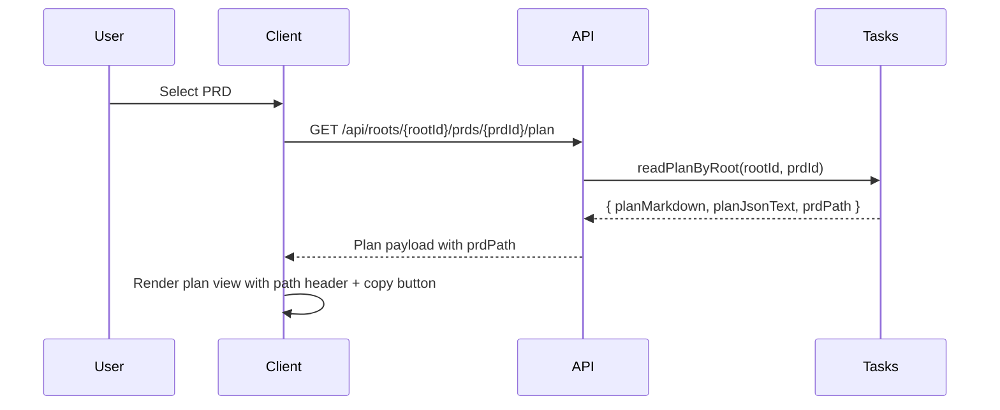

# Implementation Plan: Show PRD Folder Path in Markdown Preview

## Overview

Display the full PRD folder path at the top of the right-pane markdown preview and add a copy button next to it.

## Goal

When a PRD is selected, the markdown preview in the main content pane shows the full PRD folder path at the top with a copy button that provides accessible feedback.

## Scope

- Included: plan API returns PRD path, client renders the path header in the markdown preview, copy button with fallback, and styling for the new header.
- Excluded: sidebar copy behavior changes, config editor changes, or any filesystem layout changes.

## Prerequisites

- Familiarity with the existing plan API and client plan view rendering.
- Clipboard fallback pattern used in the sidebar.

## Design

### Data Flow

### UI/UX Design

- Add a path header above the markdown sections in the plan markdown pane (within the main/right content pane).
- Show the full path in a monospace, muted style; allow wrapping so the full path is visible.
- Place a copy button to the right of the path text.
- Use a `role="status"` live region (`aria-live="polite"`, `aria-atomic="true"`) for copy feedback and a `data-state` attribute to drive visual states.
- If `prdPath` is missing or falsy (undefined/null/empty string), do not render the header.
- Keep the header aligned to the same max width (750px) as markdown content.

## Decisions

| Topic | Decision | Rationale |
| --- | --- | --- |
| PRD path source | Add `prdPath` to the plan API payload | Server knows the real PRD directory (including worktrees); client avoids guessing. |
| Path value | Use the real path returned by `resolvePrdDir` | Ensures the path matches the actual filesystem location. |
| Path exposure | Return the full path without masking | PiggyChick is a local-only viewer; the requirement explicitly asks for the full path. |
| Copy UX | Mirror sidebar behavior with `data-state` reset after ~1500ms | Keeps user feedback consistent and predictable. |
| Clipboard helper | Keep a local `copyWithFallback` in plan view | Avoids expanding scope by refactoring sidebar; behavior remains identical. |
| Placement | Insert header above doc nav in the markdown pane | Satisfies "top of markdown preview" requirement and keeps nav below. |

## Tasks

### B1: Return PRD path from plan API

- **ID**: `139ab646-f93a-4ebf-9f61-29292a3efe4b`
- **Category**: `backend`
- **File(s)**: `src/server/tasks.ts`, `src/server/routes.ts`

#### Description

Extend the plan read path to include the full PRD directory path in the plan API response.

#### Details

- Update `readPlan` to return `{ planMarkdown, planJsonText, prdPath }`, using the path resolved by `resolvePrdDir`.
- Ensure `readPlanByRoot` returns the extended payload unchanged.
- Keep error handling and validation behavior identical.

#### Acceptance Criteria

- [ ] `GET /api/roots/{rootId}/prds/{prdId}/plan` includes `prdPath`.
- [ ] Worktree PRDs return the correct worktree folder path.
- [ ] Invalid PRD requests return existing errors without regressions.

### F1: Render PRD path header with copy action

- **ID**: `1907beae-8328-4f67-8bc0-7204d3f32912`
- **Category**: `frontend`
- **File(s)**: `src/client/api.ts`, `src/client/main.ts`, `src/client/components/plan-view.ts`

#### Description

Wire the new `prdPath` into the client state and render a header at the top of the markdown preview with a copy button and accessible feedback.

#### Details

- Extend `PlanPayload` to include `prdPath`.
- Store `prdPath` in `state.lastPlan` and pass it to `renderPlanView`.
- Update `renderPlanView` signature to accept `prdPath` and create a header element:
  - Path text element with full path string.
  - Copy button with `aria-label`, `title`, and `data-state`.
  - `role="status"` live region (`aria-live="polite"`, `aria-atomic="true"`).
- Implement `copyWithFallback` (clipboard API + execCommand fallback) scoped to the plan view.
- On copy success/failure, set `data-state` to `copied` or `error`, then reset to `idle` after ~1500ms (matching sidebar behavior).
- Insert the header above any doc nav by using `prepend` ordering.
- If `prdPath` is missing or falsy, skip rendering the header.

#### Acceptance Criteria

- [ ] Selecting a PRD shows its full folder path at the top of the markdown pane.
- [ ] Copy button copies the full path and announces feedback via the live region.
- [ ] Copy state resets after the timeout.
- [ ] Doc navigation remains below the path header and still works.
- [ ] Button has an accessible name (`aria-label`).

### F2: Style PRD path header and copy button

- **ID**: `2264ec53-3aee-48c6-ad84-84bdd592cff1`
- **Category**: `frontend`
- **File(s)**: `src/client/styles.css`

#### Description

Add styling for the new PRD path header so it aligns with existing markdown layout and provides clear copy feedback states.

#### Details

- Add `.plan-prd-path` container styling (layout, spacing, border/background).
- Add `.plan-prd-path-text` for monospace, muted text, and wrapping (`overflow-wrap: anywhere`).
- Add `.plan-prd-copy` styles and `data-state` variants (idle/copied/error) consistent with sidebar.
- Ensure emoji-only button has `text-transform: none` and `letter-spacing: 0`.
- Add focus-visible outline consistent with other controls.

#### Acceptance Criteria

- [ ] Path header aligns to the markdown content width and remains readable on long paths.
- [ ] Copy button states are visually distinct and accessible on focus.
- [ ] Styling remains consistent in desktop and mobile layouts.

## Verification

1. Run `bun run lint`.
2. Run `bun run fmt`.
3. Run `bun run typecheck`.
4. Run `bun run test`.
5. Manual check: select a PRD, confirm the full path appears at the top, click copy, and paste to verify the path.
6. Manual check: copy feedback is announced and resets after the timeout.
7. Manual check: select a worktree PRD (if available) and confirm the path points to the worktree folder.
