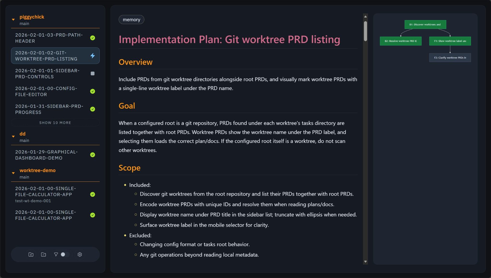

# PiggyChick

> [!WARNING]
> This project is under active development and not yet published to npm.

**A friendly viewer for AI-generated planning documents.**


## What is this?

When coding with AI agents (such as Claude Code, Codex CLI, or OpenCode),
there are "skills" that help you follow a plan-then-implement workflow.

These skills automatically generate planning documents (PRDs) in a `.tasks`
directory. **PiggyChick displays these documents in a clean, browsable web UI.**

- Beautiful Markdown rendering
- Visual dependency graphs for tasks
- Multi-project support

## Installation

Requires:

- [Node.js](https://nodejs.org/)
- [Bun](https://bun.sh/)

```bash
# Try it instantly (no install needed)
npx github:arenahito/piggychick

# Install globally (recommended)
npm install -g github:arenahito/piggychick
pgch
```

## Usage

### Register a project

Add projects you want to view in PiggyChick:

```bash
# Register current directory
pgch add

# Register a specific path
pgch add ./path/to/project
```

### Start the viewer

```bash
pgch
```

Open `http://localhost:42525` in your browser to view registered projects and
their planning documents.

### Other commands

```bash
pgch list     # List registered projects
pgch remove   # Unregister current directory
pgch config   # Show config file location
```

## Compatible Skills

PiggyChick works with `.tasks` directories created by these skills:

- **impl-plan**: Creates planning documents
- **impl-do**: Implements tasks from planning documents

Skills are located in `skills/impl/`. They work with AI agents that support
custom skills, including Claude Code, Codex CLI, OpenCode, and others.

## UI Overview



| Element | Description |
|---------|-------------|
| Sidebar | Project and PRD list with progress indicators |
| Main panel | Rendered plan markdown and task dependency graph views |

Changes under `.tasks` are picked up automatically in the UI while the viewer is open.

### Dependency Graph Controls

- `+` / `-` buttons: Zoom in and out
- `100%` button: Reset zoom to default
- `Ctrl/Meta + mouse wheel`: Zoom at pointer position
- Drag inside the graph viewport: Pan to hidden graph areas

---

## For Developers

### Required Files

Each PRD directory must contain:

- `plan.md` - The planning document
- `plan.json` - Task definitions and dependencies
  - Preferred progress field: `tasks[].status` (`pending`, `in_progress`, `done`)
  - Backward compatibility: `tasks[].passes` is still supported when `status` is absent
  - Precedence rule: when both `status` and `passes` exist, `status` is used

Additional `.md` files are shown as extra documents when present.

### Config File

Location: `~/.config/piggychick/config.jsonc`

```jsonc
{
  // PiggyChick config
  "tasksDir": ".tasks",
  "roots": [
    { "path": "/path/to/project" },
    { "path": "/path/to/other-project", "tasksDir": ".tasks-prd" }
  ]
}
```

- `tasksDir`: Task directory name (default: `.tasks`)
- `roots`: List of projects to monitor. Each project can override `tasksDir`

### Development Setup

```bash
bun install   # Install dependencies
bun run dev   # Start dev server (http://localhost:3000)
```

### Other Commands

```bash
bun run build      # Production build
bun run lint       # Run linter
bun run fmt        # Format code
bun run typecheck  # Type check
bun test           # Run tests
```
