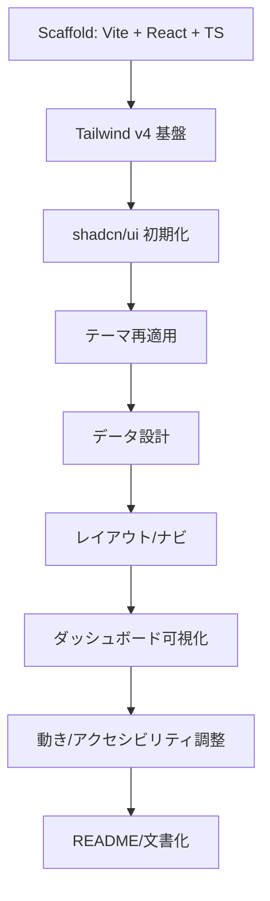
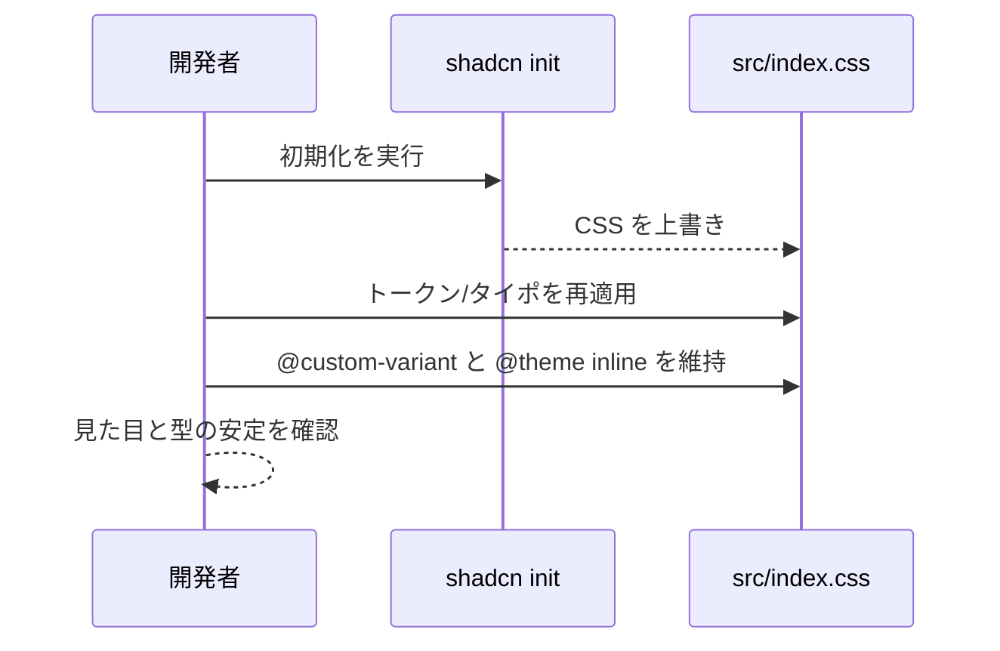
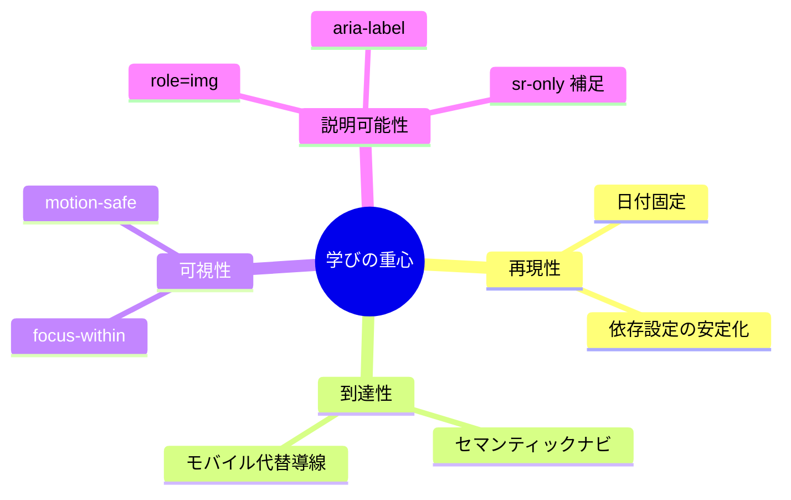

# Learning

この作業で強く残った学びは、基盤設定・テーマ設計・UI実装・文書化が一本の線でつながっているという実感だ。Vite は ESM 前提のためパス解決に fileURLToPath(new URL(..., import.meta.url)) を使うほうが安定し、設定の揺れが減る。Tailwind v4 は Vite プラグインと CSS の @import "tailwindcss" を前提にした構成が要となり、土台が整えばテーマの一貫性を担保できる。shadcn/ui の初期化は CSS を上書きするため、トークンとタイポグラフィの再適用が不可欠だという理解に至った。

データ設計では、系列データの並び順や KPI の単位整合が UI の説得力に直結することを改めて認識した。固定日付の採用は再現性の強化につながるが、最新感の表現とトレードオフになる。レイアウトとナビゲーションでは、セマンティクスと到達性の両立が軸となる。nav/ul/li/a と aria-current を使い、モバイルでサイドレールを隠す場合は代替導線を用意する判断が欠かせない。可視性と動きの面では motion-safe による reduced-motion 対応や focus-within の活用が堅実な改善になる。チャートの型差異は最小プロップ型の自前定義で吸収し、role=img と aria-label を付与してアクセシビリティを担保する。Badge は読み上げの癖を踏まえて sr-only で補足する設計が有効だ。

下記は学びの流れと依存関係を可視化したものだ。

CSS の上書きと再適用の関係は、初期化の副作用を前提に回復手順を組み込む思考へつながる。

設計上の力点は「再現性」「到達性」「可視性」「説明可能性」のバランスに集約される。

結果として、基盤の安定性が UI の一貫性を支え、UI の一貫性がデータの説得力を引き上げるという循環が明確になった。ドキュメントは指示に従って言語を統一し、実装の意図を同じ温度で残すことが重要だと結論づけた。
