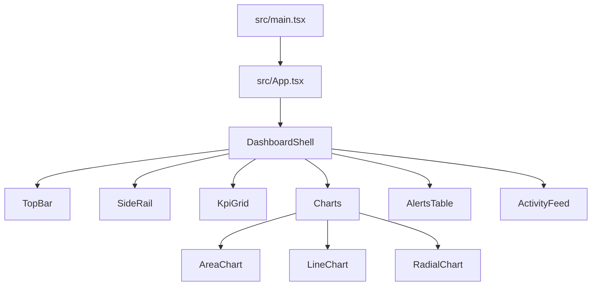
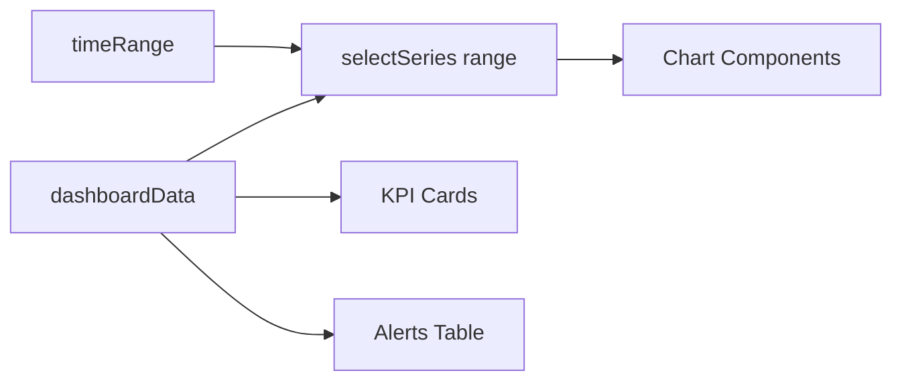
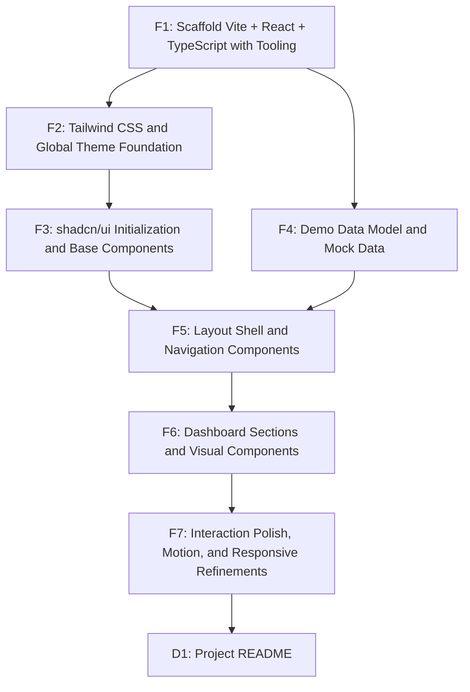

# Implementation Plan: Graphical Dashboard Demo App (Frontend Only)

## Overview

Create a local, frontend-only demo app that renders a cool, dark-themed graphical dashboard with rich visuals, charts, and mock data. The app runs with Vite + React + TypeScript, styled with Tailwind and shadcn/ui.

## Goal

Running `pnpm dev` launches a responsive, single-page dashboard that looks polished and modern, with multiple data visualizations, KPI cards, an alerts table, and an activity feed, all backed by deterministic mock data and no backend dependencies.

## Scope

- Included:
  - Vite + React + TypeScript app scaffolded for local development
  - Tailwind + shadcn/ui setup with dark theme tokens
  - Graphical dashboard UI (cards, charts, table, feed, navigation)
  - Deterministic mock data and simple local state (filters/time range)
  - Responsive layout for desktop and mobile
- Excluded:
  - Backend APIs, persistence, authentication, or real-time data
  - Server-side rendering or routing
  - Automated tests (manual verification only)

## Prerequisites

- Node.js and pnpm available via Volta (pin to current LTS and stable pnpm)
- shadcn/ui CLI available via `pnpm dlx shadcn@latest`
- Familiarity with React, Vite, TypeScript, Tailwind, and shadcn/ui

## Design

### Architecture and Component Structure

- Single-page app rendered by `src/main.tsx` -> `src/App.tsx`
- Modular dashboard components grouped by feature:
  - `src/components/layout/*` (shell, top bar, side rail)
  - `src/components/dashboard/*` (KPI grid, alerts table, activity feed)
  - `src/components/charts/*` (area/line/bar/radial visualizations)
  - `src/components/ui/*` (shadcn/ui components)
- Data in `src/data/*` with typed interfaces and exported constants

### Data Flow and State

- `dashboardData` provides static datasets and labels
- Local UI state tracks `timeRange` and `viewMode`
- Derived series are computed with `useMemo` and passed as props

### UI/UX Design

**Design System**

- Typography:
  - Headings: "Space Grotesk" (700)
  - Body/UI: "Manrope" (400/500)
  - Numeric: "JetBrains Mono" (500)
- Color direction: deep slate base with cyan/teal accents
- Base spacing: 4px scale, radius 12px for cards, 9999px for pills
- Component library: shadcn/ui (Button, Card, Tabs, Table, Badge, Progress, Tooltip, Separator, Avatar)

**Design Tokens (CSS Variables)**

Use Tailwind CSS variables so shadcn/ui tokens map to dark theme defaults.

- `--background`: 220 28% 6%
- `--foreground`: 210 40% 96%
- `--card`: 222 24% 10%
- `--card-foreground`: 210 40% 96%
- `--popover`: 222 24% 10%
- `--popover-foreground`: 210 40% 96%
- `--primary`: 190 80% 55%
- `--primary-foreground`: 220 28% 8%
- `--secondary`: 223 20% 14%
- `--secondary-foreground`: 210 40% 96%
- `--muted`: 223 16% 18%
- `--muted-foreground`: 215 18% 70%
- `--accent`: 160 72% 45%
- `--accent-foreground`: 220 28% 8%
- `--destructive`: 0 75% 60%
- `--border`: 223 18% 20%
- `--input`: 223 18% 20%
- `--ring`: 190 80% 55%

**User Flow / Wireframe**

- Top bar: brand, search, status chips, time range tabs
- Left side rail (desktop only): quick links + mini stats
- Main grid:
  1. KPI strip (4–5 cards)
  2. Large area chart + small radial capacity chart
  3. Alerts table (left) + activity feed (right)

**Interaction Patterns**

- Time range tabs update charts (7d/30d/90d)
- Hover: cards elevate, charts highlight series, table row glow
- Motion: staggered section reveal, subtle gradient shimmer on KPI

**Accessibility**

- WCAG 2.1 AA contrast for text and interactive elements
- Focus-visible ring using `--ring` token
- Keyboard-navigable tabs and buttons
- Respect `prefers-reduced-motion`

## Decisions

| Topic | Decision | Rationale |
|-------|----------|-----------|
| App scaffold | Vite + React + TypeScript | Fast local dev, minimal setup |
| UI system | shadcn/ui + Tailwind | Consistent components + utility styling |
| Tailwind version | Tailwind CSS v4 with `@tailwindcss/vite` | Aligns with shadcn/ui Vite installation docs |
| Theme | Dark by default with cyan/teal accents | “Cool” visual style requirement |
| Charts | Recharts for area/line/radial charts | Fast to implement, React-friendly |
| Data | Static deterministic mock data in `src/data` | No backend, consistent demos |
| Fonts | Space Grotesk + Manrope + JetBrains Mono | Distinct, technical aesthetic |
| Linting | Use `oxlint` only; remove ESLint if present | Matches requested tooling, avoids duplicate linting |

## Tasks

### F1: Scaffold Vite + React + TypeScript with Tooling

- **ID**: `5f7a1f1e-2c3d-4c6a-9a7b-1a0b2c3d4e5f`
- **Category**: `frontend`
- **File(s)**: `package.json`, `vite.config.ts`, `tsconfig.json`, `tsconfig.node.json`, `src/main.tsx`

#### Description

Initialize the project using Vite’s React + TypeScript template and establish core tooling. Configure Volta versions, pnpm scripts, and Vite path aliases so the rest of the project can rely on consistent imports.

#### Details

- Run `pnpm create vite@latest` and choose React + TypeScript
- Install `oxlint` as a dev dependency: `pnpm add -D oxlint`
- Add `packageManager` and `volta` fields in `package.json`
- Add `@vitejs/plugin-react` if missing and enable path alias `@` to `./src`
- Update `tsconfig.json` with `paths` matching the Vite alias
- Ensure `src/main.tsx` mounts `<App />` and imports `src/index.css`
- Add scripts: `dev`, `build`, `preview`, `lint` (use `oxlint .`)
- If the template includes ESLint config or scripts, remove or disable them

#### Acceptance Criteria

- [ ] `pnpm dev` starts a Vite React + TS app with no errors
- [ ] `@/` alias resolves in TS and Vite
- [ ] `pnpm lint` runs `oxlint` successfully

### F2: Tailwind CSS and Global Theme Foundation

- **ID**: `1b2c3d4e-5f6a-4b7c-8d9e-0f1a2b3c4d5e`
- **Category**: `frontend`
- **File(s)**: `tailwind.config.ts`, `src/index.css`, `index.html`

#### Description

Add Tailwind CSS with the Vite plugin and establish the dark theme tokens and base styles. This includes fonts, background gradients, and default typography styles.

#### Details

- Install Tailwind with `pnpm add tailwindcss @tailwindcss/vite`
- Update `vite.config.ts` to include `tailwindcss()` plugin (per shadcn/ui Vite docs)
- Create `tailwind.config.ts` with `content` paths: `./index.html`, `./src/**/*.{ts,tsx}`
- If the CLI generates a Tailwind v4 config, keep its structure and ensure the content paths include Vite files
- In `src/index.css`:
  - Import Tailwind v4 (`@import "tailwindcss";`)
  - Define CSS variables for the dark theme tokens
  - Set base styles for `body`, `h1`-`h4`, and numeric text classes
- Add Google Fonts links in `index.html` and set font-family defaults with system fallbacks
- Apply `class="dark"` on `html` to force dark mode by default

#### Acceptance Criteria

- [ ] Tailwind utilities work in components
- [ ] Dark theme renders with correct background/foreground colors
- [ ] Fonts load and apply to headings/body/numeric text

### F3: shadcn/ui Initialization and Base Components

- **ID**: `7c8d9e0f-1a2b-4c3d-8e9f-0a1b2c3d4e5f`
- **Category**: `frontend`
- **File(s)**: `components.json`, `src/lib/utils.ts`, `src/components/ui/*`

#### Description

Initialize shadcn/ui for the project and add the base components needed for the dashboard layout and widgets.

#### Details

- Run `pnpm dlx shadcn@latest init` with:
  - Style: `default`
  - Base color: `slate`
  - CSS file: `src/index.css`
  - Tailwind config: `tailwind.config.ts`
  - CSS variables: `yes`
  - Aliases: `@/components`, `@/lib/utils`
  - RSC: `no`
- If `init` overwrites `src/index.css` or `tailwind.config.ts`, re-apply the custom tokens and base styles after the CLI finishes
- Ensure `components.json` reflects the above configuration
- Add `src/lib/utils.ts` with `cn` helper (clsx + tailwind-merge)
- Add shadcn/ui components:
  - `button`, `card`, `badge`, `tabs`, `table`, `tooltip`, `separator`, `progress`, `avatar`
- Confirm required dependencies were added by the CLI; if missing, add `class-variance-authority`, `clsx`, and `tailwind-merge`
- If any component uses `animate-*` utilities, add `tailwindcss-animate`

#### Acceptance Criteria

- [ ] `components.json` aligns with Vite + Tailwind config
- [ ] shadcn/ui components compile without TS errors
- [ ] `cn` helper is available at `@/lib/utils`
- [ ] F2 acceptance criteria still pass after shadcn init

### F4: Demo Data Model and Mock Data

- **ID**: `a1b2c3d4-e5f6-4a7b-8c9d-0e1f2a3b4c5d`
- **Category**: `frontend`
- **File(s)**: `src/data/types.ts`, `src/data/dashboard.ts`

#### Description

Define typed data structures and create deterministic mock data for KPIs, charts, alerts, and activity. The dataset should feel realistic and support time range filtering.

#### Details

- Create interfaces: `Kpi`, `SeriesPoint`, `Alert`, `ActivityItem`, `RegionTraffic`, `SystemNode`
- Export `dashboardData` with:
  - `kpis`: 4–5 KPI cards (value, delta, trend)
  - `series`: 90-day time series for throughput/latency
  - `alerts`: 6–8 alert rows with severity
  - `activity`: 8–10 feed items with timestamps
  - `regions`: traffic distribution for bar/radial
- Add helper `selectSeries(range: "7d" | "30d" | "90d")` that returns the latest N points based on chronological order

#### Acceptance Criteria

- [ ] All mock data is typed and deterministic
- [ ] Time range selection returns correct slices
- [ ] Data covers all sections of the dashboard

### F5: Layout Shell and Navigation Components

- **ID**: `b2c3d4e5-f6a7-4b8c-9d0e-1f2a3b4c5d6e`
- **Category**: `frontend`
- **File(s)**: `src/App.tsx`, `src/components/layout/DashboardShell.tsx`, `src/components/layout/TopBar.tsx`, `src/components/layout/SideRail.tsx`

#### Description

Build the overall shell and navigation layout using CSS grid. Establish regions for top bar, side rail, and the main dashboard grid.

#### Details

- `DashboardShell` wraps the page and applies gradient background + noise overlay
- `TopBar` includes brand, search input, status chips, and time range tabs
- `SideRail` shows quick links and mini stats; collapses on mobile
- `App.tsx` composes `DashboardShell` and wires `timeRange` state

#### Acceptance Criteria

- [ ] Page layout matches the wireframe structure
- [ ] Side rail hides on small screens
- [ ] Top bar and tabs are keyboard accessible

### F6: Dashboard Sections and Visual Components

- **ID**: `c3d4e5f6-a7b8-4c9d-0e1f-2a3b4c5d6e7f`
- **Category**: `frontend`
- **File(s)**: `src/components/dashboard/*`, `src/components/charts/*`

#### Description

Implement the core dashboard sections: KPI grid, charts, alerts table, and activity feed. Use Recharts for the main visualizations and shadcn/ui for cards and tables.

#### Details

- Install `recharts` and `lucide-react`
- Create chart components:
  - `ThroughputAreaChart` (area + gradient)
  - `LatencyLineChart` (line + tooltip)
  - `CapacityRadial` (radial bar)
- Implement `KpiGrid` using shadcn `Card` and `Badge`
- Implement `AlertsTable` using shadcn `Table` with severity pills
- Implement `ActivityFeed` with timeline styling
- Ensure charts respond to `timeRange` state

#### Acceptance Criteria

- [ ] Charts render with mock data and update on range change
- [ ] KPI cards show value, delta, and trend icon
- [ ] Alerts table and activity feed render with correct styling

### F7: Interaction Polish, Motion, and Responsive Refinements

- **ID**: `d4e5f6a7-b8c9-4d0e-1f2a-3b4c5d6e7f8a`
- **Category**: `frontend`
- **File(s)**: `src/components/**/*`, `src/index.css`

#### Description

Add finishing touches: hover effects, motion-safe animations, responsive breakpoints, and minor accessibility adjustments.

#### Details

- Add hover elevation and border glow for cards
- Add staggered entry using `transition`, `duration`, and `motion-safe`
- Use `prefers-reduced-motion` to disable heavy animations
- Ensure tables and charts stack cleanly at small widths
- Add focus-visible rings to all interactive elements

#### Acceptance Criteria

- [ ] Hover and focus states are consistent across UI
- [ ] Layout is usable on mobile widths
- [ ] Motion respects reduced-motion settings
- [ ] Key text and button contrast checked with browser devtools

### D1: Project README

- **ID**: `e5f6a7b8-c9d0-4e1f-2a3b-4c5d6e7f8a9b`
- **Category**: `documentation`
- **File(s)**: `README.md`

#### Description

Document how to install, run, and build the demo app, including brief notes on the data model and theming.

#### Details

- Add setup steps: `pnpm install`, `pnpm dev`
- Add build/lint steps: `pnpm build`, `pnpm lint`
- Summarize the dashboard sections and mock data source

#### Acceptance Criteria

- [ ] README includes setup and run instructions
- [ ] README explains where mock data lives

## Task Dependencies

## Verification

- `pnpm install`
- `pnpm dev` and visually confirm:
  - dark theme applied by default
  - charts update when time range changes
  - layout remains usable at 375px width
- Use browser devtools contrast checker on primary text and buttons
- `pnpm build` completes without errors
- `pnpm lint` runs `oxlint .` without errors
