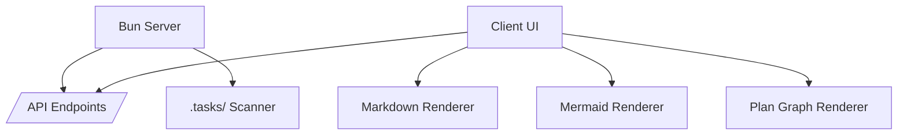
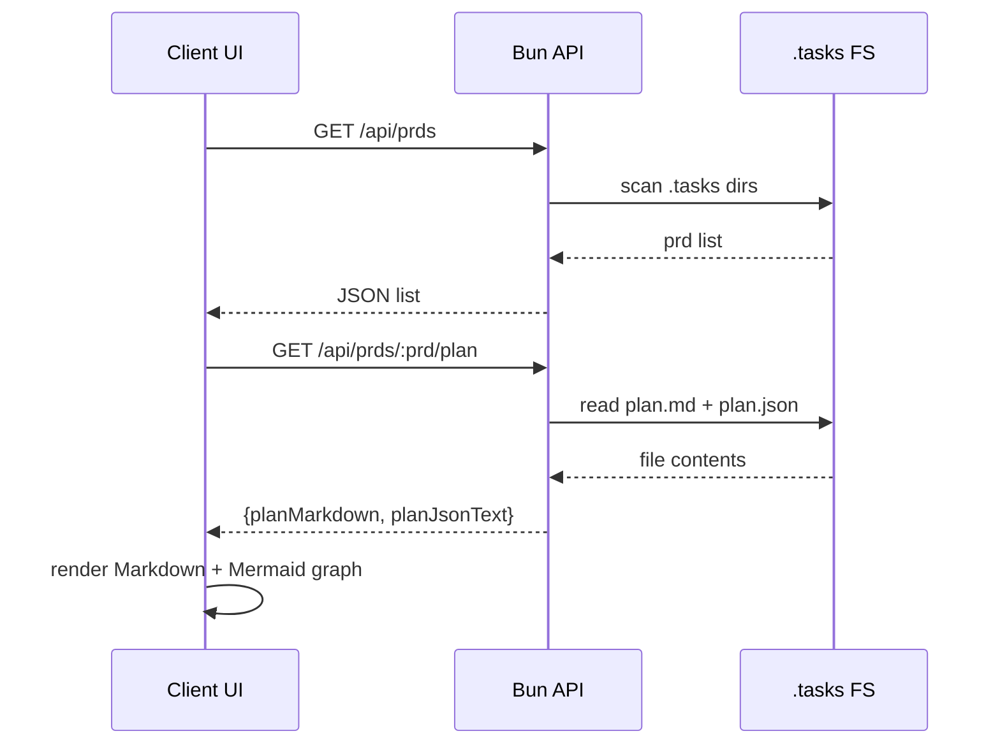
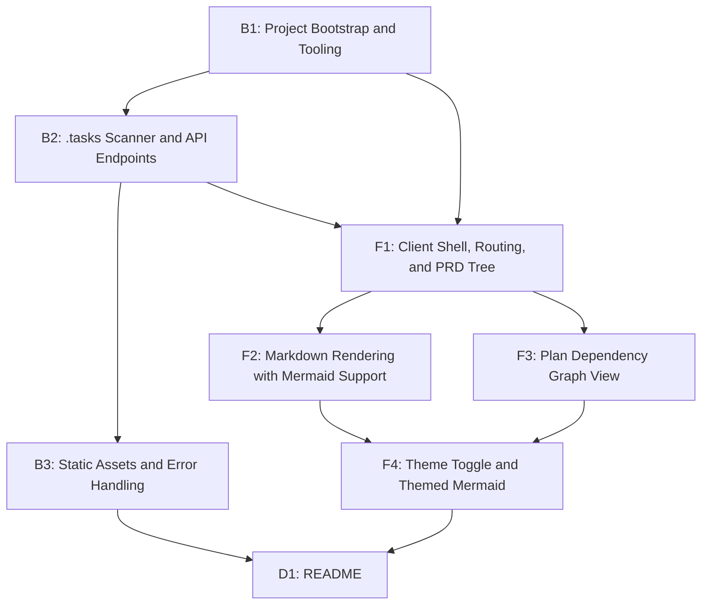

# Implementation Plan: Markdown Plan Viewer Server

## Overview

Build a local Bun-powered web server that reads `.tasks/` PRD directories and renders GitHub-flavored Markdown in a two-pane UI. The app supports Mermaid diagrams embedded in Markdown and a plan dependency graph generated from `plan.json`, with a dark-by-default theme and a light/dark toggle.

## Goal

Running `bun run dev` launches a local server that lists PRDs from `./.tasks/`, lets users view `plan`, `memory`, and `learning` docs, renders Mermaid diagrams, and shows a color-coded dependency graph for `plan.json` with a dark theme by default and a toggle to light.

## Scope

- Included:
  - Bun server that reads `.tasks/` and exposes API endpoints for PRD content
  - Client UI with left PRD tree and right content panel
  - GitHub-flavored Markdown rendering with Mermaid support
  - Plan dependency graph visualization from `plan.json` with pass-based coloring
  - Dark default theme with light/dark toggle and persistence
- Excluded:
  - Editing or writing `.tasks` files
  - Authentication, multi-user support, or remote hosting
  - PDF export or printing

## Prerequisites

- Bun runtime available locally
- `oxlint` used as the only linter
- Familiarity with TypeScript, Bun server APIs, and DOM rendering

## Design

### Architecture and Component Structure

- Server
  - `src/server/index.ts`: Bun server entry, routes, static assets
  - `src/server/tasks.ts`: filesystem access and PRD discovery
  - `src/server/routes.ts`: API routing and response helpers
- Client
  - `src/client/main.ts`: SPA bootstrap, routing, UI rendering
  - `src/client/api.ts`: fetch wrapper and types
  - `src/client/renderers/*`: markdown + graph rendering helpers
  - `src/client/styles.css`: theme tokens and layout

### Data Flow and Key Interactions

- Client loads PRD list from `GET /api/prds`.
- Selecting a node loads content from `GET /api/prds/:prd/:doc`.
- For `plan`, the client renders `plan.md` (Markdown) and generates a Mermaid flowchart from `plan.json`.

### API Contracts

- `GET /api/prds`
  - Response: `[{ id: string, label: string, hasMemory: boolean, hasLearning: boolean }]`
  - Only include directories with both `plan.md` and `plan.json`.
- `GET /api/prds/:prd/plan`
  - Response: `{ planMarkdown: string, planJsonText: string }`
- `GET /api/prds/:prd/memory` | `GET /api/prds/:prd/learning`
  - Response: `{ markdown: string }`
  - If the file is missing, respond `404`.
- Error response (all API routes):
  - `{ error: { code: string, message: string } }`

### Markdown + Mermaid Rendering

- Use `markdown-it` with GitHub-flavored settings:
  - `html: false`, `linkify: true`, `typographer: false`
  - `markdown-it-task-lists` for task lists
- Apply `github-markdown-css` to match GitHub styles.
- For Mermaid code fences, render as `<pre class="mermaid">` and call `mermaid.run()` after HTML injection.
- Sanitize rendered HTML with `DOMPurify` before insertion.
- Set Mermaid `securityLevel: "strict"` and `startOnLoad: false`.

### Plan Graph Rendering

- Convert `plan.json` tasks to a Mermaid `flowchart TD` string.
- Escape labels (replace `[` `]` `(` `)` `|` `"` and newlines) before embedding.
- Create node classes:
  - `pass`: green fill + border
  - `fail`: neutral/gray fill
- Assign class based on `passes`.
- Render with Mermaid using the current theme.

### UI/UX Design

**Design System**

- Typography:
  - UI: "IBM Plex Sans"
  - Code blocks: "JetBrains Mono"
- Layout:
  - Two-pane shell: left sidebar (PRD tree), right main content
  - Plan view: split main content into markdown (left) and graph (right)
- Spacing: 8px base scale, 12px radius for panels

**Theme Tokens (CSS Variables)**

- Dark (default):
  - `--bg`: #0f1115
  - `--panel`: #161a22
  - `--text`: #e6edf3
  - `--muted`: #9da7b3
  - `--accent`: #7cc4ff
- Light:
  - `--bg`: #f6f7f9
  - `--panel`: #ffffff
  - `--text`: #1f2328
  - `--muted`: #5f6a76
  - `--accent`: #0969da

**Interaction Patterns**

- Sidebar tree expand/collapse per PRD
- Active selection highlight
- Theme toggle in top bar; persisted in `localStorage`

**Accessibility**

- Minimum 4.5:1 contrast for text
- Keyboard focus styles for navigation items
- Respect `prefers-reduced-motion` (no required animations)

## Decisions

| Topic             | Decision                         | Rationale                                      |
| ----------------- | -------------------------------- | ---------------------------------------------- |
| Server runtime    | Bun built-in server              | Minimal setup and matches required stack       |
| Client stack      | Vanilla TypeScript + DOM         | Small footprint, no framework requirement      |
| Markdown renderer | markdown-it + GFM plugins        | Reliable GitHub-flavored Markdown support      |
| Markdown styling  | github-markdown-css              | Familiar GitHub appearance                     |
| Mermaid rendering | mermaid client-side              | Supports both embedded diagrams and graph view |
| Graph generation  | Mermaid flowchart from plan.json | Leverages same renderer and theming            |
| Linting           | oxlint only                      | Matches requirement, avoids duplicate linting  |
| .tasks root       | Fixed to `./.tasks` (cwd)        | Matches requirement; no env override needed    |
| plan.json parsing | Client parses raw JSON text      | Enables readable error state on invalid JSON   |
| Client build      | `bun build` + static file copy   | Minimal tooling under Bun stack                |
| Fonts             | Google Fonts CDN                 | Offline support not required                   |

## Tasks

### B1: Project Bootstrap and Tooling

- **ID**: `9a2c6f5a-4f13-4d33-8b49-26b0c5b9c2f7`
- **Category**: `backend`
- **File(s)**: `package.json`, `tsconfig.json`, `src/server/index.ts`, `src/client/index.html`, `src/client/main.ts`, `src/client/styles.css`

#### Description

Initialize a Bun project with TypeScript configuration, scripts, and baseline entry points for server and client. Establish linting with `oxlint` and add the dependencies required by later tasks.

#### Details

- Create `package.json` scripts:
  - `dev`: `concurrently "bun --watch src/server/index.ts" "bun run dev:client"`
  - `dev:client`: `mkdir -p dist dist/assets` then `cp src/client/index.html dist/index.html && cp src/client/styles.css dist/styles.css && cp node_modules/github-markdown-css/github-markdown.css dist/markdown.css`, then `bun build --watch src/client/main.ts --outdir dist/assets --target browser`
  - `build`: run `build:client` then (optionally) `bun build` for server
  - `build:client`: `mkdir -p dist dist/assets` then `bun build src/client/main.ts --outdir dist/assets --target browser`, then `cp src/client/index.html dist/index.html && cp src/client/styles.css dist/styles.css && cp node_modules/github-markdown-css/github-markdown.css dist/markdown.css`
  - `lint`: `oxlint .`
- Add dependencies: `markdown-it`, `markdown-it-task-lists`, `mermaid`, `dompurify`, `github-markdown-css`
- Add dev dependencies: `oxlint`, `typescript`, `concurrently`
- Create minimal `src/server/index.ts` that responds with a placeholder HTML from `dist/index.html` (or a stub)
- Create `src/client/index.html` with:
  - `<link>` tags for IBM Plex Sans and JetBrains Mono (Google Fonts)
  - `<link>` tags for `styles.css` and `markdown.css`
  - ``
- Create minimal `src/client/main.ts` that renders a placeholder root element
- Add `src/client/styles.css` with root theme tokens and base layout placeholders
- Build pipeline (client):
  - `bun build src/client/main.ts --outdir dist/assets --target browser`
  - Copy `src/client/index.html` -> `dist/index.html`
  - Copy `src/client/styles.css` -> `dist/styles.css`
  - Copy `node_modules/github-markdown-css/github-markdown.css` -> `dist/markdown.css`
- Note: changes to `index.html`, `styles.css`, or `markdown.css` require re-running `dev:client`

#### Acceptance Criteria

- [ ] `bun run dev` starts a server without runtime errors
- [ ] `bun run lint` runs `oxlint` successfully
- [ ] Client build output is generated into `dist/`

### B2: .tasks Scanner and API Endpoints

- **ID**: `1d7d6e1d-3b4d-4f78-8c9b-0a3f9a5b1f20`
- **Category**: `backend`
- **File(s)**: `src/server/tasks.ts`, `src/server/routes.ts`, `src/server/index.ts`

#### Description

Implement filesystem scanning for `.tasks/` and provide API endpoints that return PRD listings and document content. Enforce validation so incomplete PRD directories are excluded.

#### Details

- In `tasks.ts`, implement:
  - `listPrds(root: string)` -> array of PRDs with presence flags
  - `readPlan(prd: string)` -> `plan.md` and raw `plan.json` text (no parse)
  - `readMarkdown(prd: string, kind: "memory" | "learning")`
- Validate directory traversal: reject `..` and path separators in `prd`
- Avoid symlink escape: use `lstat` to skip symlinks or `realpath` checks against root
- Only include PRD directories that contain both `plan.md` and `plan.json`
- In `routes.ts`, add route handlers:
  - `GET /api/prds`
  - `GET /api/prds/:prd/plan`
  - `GET /api/prds/:prd/memory` and `/learning`
- Return `404` for missing docs

#### Acceptance Criteria

- [ ] `/api/prds` returns only complete PRD directories
- [ ] `/api/prds/:prd/plan` returns both markdown and JSON
- [ ] Missing `memory.md` or `learning.md` returns `404`
- [ ] Path traversal attempts are rejected
- [ ] `plan.json` is returned as raw text (client parses)

### B3: Static Assets and Error Handling

- **ID**: `f0c8d6b1-6e2b-4d3e-9f2a-6b7c8d9e0f12`
- **Category**: `backend`
- **File(s)**: `src/server/index.ts`, `src/server/routes.ts`

#### Description

Serve the client bundle and add consistent error responses. Ensure that the server returns the SPA entry for non-API routes.

#### Details

- Serve `dist/` files with correct content types
- For unknown non-API routes, serve `dist/index.html`
- Add JSON error responses for API failures with status codes
  - Shape: `{ error: { code, message } }`
- Add caching headers for static assets in `dist/` (optional, short-lived)

#### Acceptance Criteria

- [ ] App loads at `/` and renders the client UI
- [ ] Non-API routes return `index.html`
- [ ] API errors return JSON with status codes

### F1: Client Shell, Routing, and PRD Tree

- **ID**: `3c8b0a9d-2d3e-4a1b-9f8c-1e2d3c4b5a6f`
- **Category**: `frontend`
- **File(s)**: `src/client/main.ts`, `src/client/api.ts`, `src/client/components/layout.ts`, `src/client/components/sidebar.ts`

#### Description

Build the client layout with a left sidebar tree and right main panel. Implement minimal routing state so selecting `plan`, `memory`, or `learning` loads the correct view.

#### Details

- Fetch PRD list on load and render a tree structure
- Sidebar nodes:
  - PRD name
  - Child items: `plan`, `memory`, `learning` (only show memory/learning if present)
- Maintain selection state in the URL hash or in-memory state
- Render placeholders in the main panel before content loads
- Add responsive layout: sidebar collapses into top dropdown under 900px

#### Acceptance Criteria

- [ ] Sidebar shows PRD tree with correct child items
- [ ] Selecting items updates main panel content area
- [ ] Layout is usable on narrow screens

### F2: Markdown Rendering with Mermaid Support

- **ID**: `6a9d2f3b-5c4e-4b1a-8d7c-9e0f1a2b3c4d`
- **Category**: `frontend`
- **File(s)**: `src/client/renderers/markdown.ts`, `src/client/styles.css`

#### Description

Render GitHub-flavored Markdown content and support Mermaid diagrams embedded in Markdown code fences.

#### Details

- Configure `markdown-it` default preset (tables + strikethrough) with `linkify: true` and `typographer: false`
- Add `markdown-it-task-lists` for task lists
- Disable raw HTML in markdown-it (`html: false`)
- Convert Mermaid code fences to `<pre class="mermaid">` blocks
- Sanitize the generated HTML with `DOMPurify`
- Apply `github-markdown-css` and add theme-aware overrides (background, link color)
- Wrap rendered markdown in `.markdown-body` for GitHub CSS
- Initialize Mermaid with `securityLevel: "strict"` and `startOnLoad: false`
- After injecting HTML, run `mermaid.run({ nodes: document.querySelectorAll(".mermaid") })` to render diagrams

#### Acceptance Criteria

- [ ] GFM features (tables, task lists, strikethrough) render correctly
- [ ] Mermaid diagrams inside markdown render as SVG
- [ ] Markdown area follows the active theme colors

### F3: Plan Dependency Graph View

- **ID**: `8b1c2d3e-4f5a-4b6c-8d9e-0f1a2b3c4d5e`
- **Category**: `frontend`
- **File(s)**: `src/client/renderers/plan-graph.ts`, `src/client/components/plan-view.ts`

#### Description

Transform `plan.json` into a Mermaid flowchart that visualizes task dependencies and status. Display this graph in the right pane of the plan view.

#### Details

- Parse `planJsonText` on the client with `try/catch`
- On parse failure, show error text in the graph pane and skip rendering
- Generate Mermaid flowchart string:
  - One node per task (`taskId[title]`)
  - Edges from dependencies
  - Class definitions for `pass` and `fail`
- Escape label text before embedding (replace `[` `]` `(` `)` `|` `"` and newlines)
- Render with Mermaid and fit within the right pane using `overflow: auto`
- If `plan.json` is invalid, show a readable error state instead of crashing

#### Acceptance Criteria

- [ ] Graph renders for valid `plan.json`
- [ ] Tasks with `passes: true` use the "pass" color style
- [ ] Invalid JSON shows an error message in the graph pane

### F4: Theme Toggle and Themed Mermaid

- **ID**: `0f1e2d3c-4b5a-4c6d-8e9f-1a2b3c4d5e6f`
- **Category**: `frontend`
- **File(s)**: `src/client/main.ts`, `src/client/styles.css`, `src/client/renderers/markdown.ts`, `src/client/renderers/plan-graph.ts`

#### Description

Implement light/dark theme switching with dark as default, and ensure Mermaid diagrams re-render with the selected theme.

#### Details

- Store theme in `localStorage` (`dark` default)
- Toggle adds `data-theme="dark|light"` on `html`
- Map theme tokens to Mermaid config (`theme: "dark" | "default"`)
- On theme change, re-initialize Mermaid and re-render diagrams for both markdown and graph panes

#### Acceptance Criteria

- [ ] Dark theme is default on first load
- [ ] Toggle switches theme and persists on reload
- [ ] Mermaid diagrams match the active theme

### D1: README

- **ID**: `5e4d3c2b-1a0f-4e9d-8c7b-6a5b4c3d2e1f`
- **Category**: `documentation`
- **File(s)**: `README.md`

#### Description

Document how to run the server, build the client, and explain the `.tasks` directory requirements.

#### Details

- Add setup instructions: `bun install`, `bun run dev`, `bun run build`, `bun run lint`
- Document `.tasks` directory structure and required files
- Describe plan view layout (markdown + graph) and theme toggle

#### Acceptance Criteria

- [ ] README explains how to run and build the project
- [ ] README describes `.tasks` requirements and UI behavior

## Task Dependencies

## Verification

- `bun install`
- `bun run dev` and confirm:
  - PRD list loads from `.tasks/`
  - Selecting `plan` shows Markdown + dependency graph
  - Mermaid diagrams render inside Markdown
  - Theme toggle switches and persists
- `bun run lint` passes with `oxlint`
- `bun run build` completes and serves static assets
