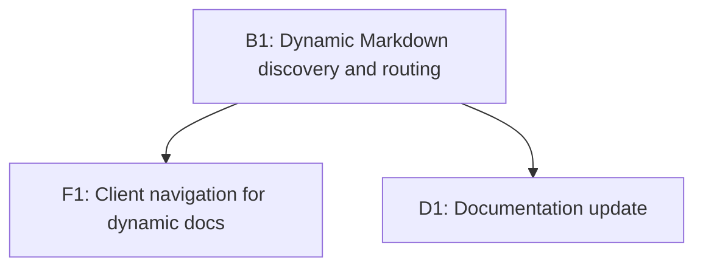

# Implementation Plan: Dynamic Markdown Documents

## Overview

Enable the viewer to list and render any Markdown files in each PRD folder (excluding `plan.md`) instead of hard-coding `memory.md` and `learning.md`.

## Goal

PRD navigation and rendering show all Markdown documents in a `.tasks/{prd}/` directory except `plan.md`, with safe path handling and no reliance on fixed file names.

## Scope

- Included:
  - Server-side discovery of Markdown files per PRD and exposure in the PRD summary API.
  - Client-side navigation that uses the discovered document list for sidebar and mobile selector.
  - Markdown document fetch route accepts dynamic document IDs.
  - README updates to describe the new behavior.
- Excluded:
  - Changes to `.tasks` discovery rules (still requires `plan.md` and `plan.json`).
  - UI redesign beyond adapting to dynamic document lists.
  - Support for nested directories inside a PRD folder.

## Prerequisites

- Understanding of existing `.tasks` layout and PRD discovery rules in `src/server/tasks.ts`.
- Basic knowledge of client routing via hash `#/{prdId}/{doc}` in `src/client/main.ts`.

## Design

### Data model

- Replace `PrdSummary.hasMemory/hasLearning` with `PrdSummary.docs: string[]` where each entry is a document ID derived from Markdown filenames (basename without the `.md` extension).
- `plan` remains a dedicated route and UI entry.

### Server behavior

- For each PRD directory, list direct child files (no recursion).
- Include files where:
  - It is a regular file (not a symlink).
  - File extension is `.md` (case-insensitive).
  - Filename is not `plan.md` (case-insensitive).
- Convert filenames to doc IDs by stripping the final `.md` extension.
- Sort doc IDs with `Intl.Collator("en", { sensitivity: "base", numeric: true })` (or equivalent) for stable ordering.
- Deduplicate doc IDs by case-insensitive key; when collisions occur, keep the first entry in the sorted list to ensure deterministic output.
- `readMarkdown(root, prd, docId)` resolves `{docId}.md` with safety checks similar to `resolvePrdDir`: reject empty/whitespace-only IDs, `.`/`..`, any path separators, `..` substring, or NUL; cap length (e.g., 120 chars). Treat `plan` (case-insensitive) as a reserved doc ID and reject it in `readMarkdown`.
- Invalid doc IDs return 400 (`invalid_doc`), while valid-but-missing docs return 404 (`not_found`).

### Client behavior

- The sidebar and mobile selector build the document list from `PrdSummary.docs`, always placing `plan` first.
- `parseHash` accepts any doc segment and validates it against the selected PRD’s known docs; invalid docs fall back to `plan` and update the hash.
- Fetching uses `/api/prds/{prdId}/{docId}` for non-plan documents.

### API contract

- `GET /api/prds` returns:
  - `[{ id, label, docs: string[] }]`
- `GET /api/prds/{prdId}/plan` returns plan payload as-is.
- `GET /api/prds/{prdId}/{docId}` returns `{ markdown }` for dynamic documents.

### UI/UX notes

- No new styling required; existing sidebar item styles apply.
- Document names displayed as-is from doc IDs (no `.md` suffix).

```mermaid
flowchart TD
    A[Client requests /api/prds] --> B[Server lists PRD directories]
    B --> C[Scan markdown files excluding plan.md]
    C --> D[Return docs list in PrdSummary]
    D --> E[Client builds sidebar/mobile entries]
    E --> F[Client fetches /api/prds/{prdId}/{docId}]
    F --> G[Server reads {docId}.md safely]
```

## Decisions

| Topic              | Decision                                                                                                              | Rationale                                                 |
| ------------------ | --------------------------------------------------------------------------------------------------------------------- | --------------------------------------------------------- |
| Doc ID format      | Use filename without `.md` extension                                                                                  | Matches current hash schema and avoids `.md` in UI labels |
| Extension handling | Match `.md` case-insensitively                                                                                        | Robust across platforms and user habits                   |
| Plan exclusion     | Always exclude `plan.md` from docs list                                                                               | Plan already has dedicated route and UI entry             |
| Sorting            | Sort doc IDs via `Intl.Collator("en", { sensitivity: "base", numeric: true })`                                        | Stable display order across environments                  |
| Doc ID validation  | Disallow empty/whitespace-only IDs, `.`/`..`, path separators, `..` substring, NUL, length > 120, and reserved `plan` | Prevent traversal and route collisions                    |
| Case collisions    | Deduplicate case-insensitively, keep first sorted entry                                                               | Deterministic behavior on case-sensitive filesystems      |

## Tasks

### B1: Dynamic Markdown discovery and routing

- **ID**: `9603f66a-b381-4fda-9132-25551c196fce`
- **Category**: `backend`
- **File(s)**: `src/server/tasks.ts`, `src/server/routes.ts`

#### Description

Update PRD summaries to expose a list of Markdown document IDs, and allow API reads for any Markdown document besides `plan.md`. Ensure path safety and exclude symlinks.

#### Details

- Replace `hasMemory/hasLearning` with `docs: string[]` in `PrdSummary`.
- In `listPrds`, scan PRD dir entries with `readdir(..., { withFileTypes: true })`:
  - Filter to regular files, non-symlink, `.md` extension.
  - Exclude `plan.md` (case-insensitive) and any doc ID that equals `plan` (case-insensitive) after stripping extension.
  - Convert filename to doc ID by removing the last `.md`.
  - Sort doc IDs deterministically and deduplicate by case-insensitive key.
- Add a safe doc ID validator (similar to `isSafePrd`) to prevent traversal and reserve `plan`, with explicit length/whitespace rules.
- Update `readMarkdown` signature to accept `docId: string` (not a fixed union) and resolve `{docId}.md`, returning 400 for invalid IDs and 404 for missing files.
- Update `routes.ts` to treat any non-`plan` segment as a doc ID and call `readMarkdown`.

#### Acceptance Criteria

- [ ] `/api/prds` returns `docs` arrays populated from existing Markdown files besides `plan.md`.
- [ ] Requests to `/api/prds/{prd}/{docId}` return the correct Markdown content when `{docId}.md` exists.
- [ ] Invalid doc IDs return 400; missing docs return 404 via existing error handling.

### F1: Client navigation for dynamic docs

- **ID**: `1d38594e-b7b4-4260-b7bf-99a7b0ecdb03`
- **Category**: `frontend`
- **File(s)**: `src/client/api.ts`, `src/client/main.ts`, `src/client/components/sidebar.ts`

#### Description

Switch the client to consume dynamic doc lists per PRD, update routing validation, and render the sidebar/mobile picker accordingly.

#### Details

- Update `PrdSummary` type to include `docs: string[]`.
- Replace hard-coded doc lists (`memory`, `learning`) with `docs` from API.
- Update `DocKind` to a flexible type (e.g., `type DocKind = "plan" | string`) and guard usage where needed.
- In `parseHash`, accept any doc segment; validate against the selected PRD’s `docs` list (or `plan`).
- Ensure selection fallback to `plan` when the requested doc is missing.
- Update the mobile selector to include all docs for each PRD.
- Update `fetchMarkdown` to accept a `docId: string`.

#### Acceptance Criteria

- [ ] Sidebar and mobile selector show all Markdown docs in each PRD, plus `plan`.
- [ ] Hash navigation to unknown docs falls back to `plan` and updates the URL.
- [ ] Non-plan document fetches succeed using the dynamic doc ID.

### D1: Documentation update

- **ID**: `3363ef86-42c0-425c-9c8f-0ecc402bf933`
- **Category**: `documentation`
- **File(s)**: `README.md`

#### Description

Reflect the new behavior in README by removing references to fixed `memory.md`/`learning.md` and documenting the dynamic Markdown discovery.

#### Details

- Update `.tasks` description to mention that any Markdown file besides `plan.md` is surfaced.
- Update UI behavior notes to reference dynamic docs list.
- Note that PRDs with no extra Markdown files show only `plan`.

#### Acceptance Criteria

- [ ] README no longer claims only `memory.md`/`learning.md` are supported.
- [ ] README explains the new dynamic doc discovery behavior.

## Task Dependencies



## Verification

- Run `bun run lint`.
- Start the server with `bun run dev` and confirm:
  - PRDs list includes extra Markdown docs (e.g., `notes.md`).
  - Selecting each doc renders its content.
  - Unknown hash doc falls back to plan.
