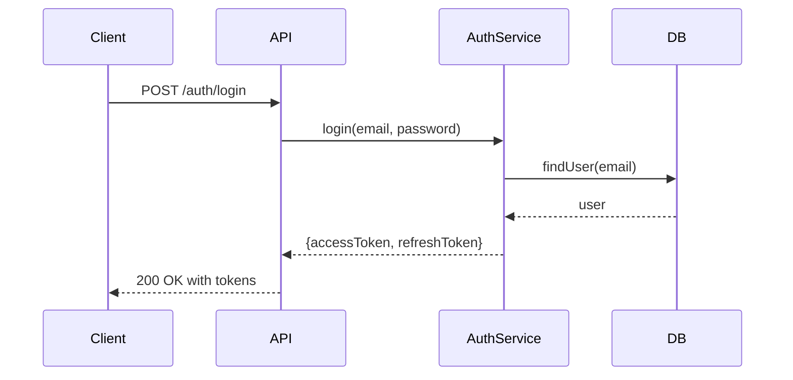

# Implementation Plan Skill

Create implementation plans for software development tasks with sufficient detail for execution.

## Workflow

### 1. Gather Requirements

Collect necessary information before planning:

- Clarify the goal and scope of the task
- **For existing codebases only**: Investigate existing code to identify affected files and understand existing patterns (skip for new projects with no existing code)
- Identify dependencies and constraints

**Clarification Process**:

1. Identify all unclear points upfront and ask the user in a batch
2. Proceed with plan creation
3. If new blockers arise, batch remaining questions and ask again

Topics that may require clarification:

- Ambiguous requirements or specifications
- Technology choices not explicitly stated
- Scope boundaries that are unclear
- Priority or ordering preferences

### 2. Analyze and Decompose

Break down the task into implementable units:

- Each task should be completable in 15-60 minutes (see [Task Granularity](#task-granularity) for details)
- Tasks should have clear inputs and outputs
- Note which tasks depend on others (detailed dependency analysis in step 4)

### 3. Create the Plan

#### Task Categories

Assign a category to each task. Categories determine the task ID prefix:

| Category        | Prefix | Target Tasks                                       |
| --------------- | ------ | -------------------------------------------------- |
| `backend`       | B      | APIs, database, business logic, server-side code   |
| `frontend`      | F      | UI components, client-side logic, styling          |
| `documentation` | D      | README, user guides, tutorials, changelog          |
| `other`         | X      | Tasks that do not fit into the above categories    |

Task prefixes are numbered per category: B1, B2, B3... / F1, F2, F3... / D1, D2, D3... / X1, X2, X3...

#### Task ID (UUID)

Each task requires a unique identifier in UUIDv4 format.

**Generation**: Use any UUID generator (e.g., `uuidgen` command, online generator, or programming language library).

**Format**: `xxxxxxxx-xxxx-4xxx-yxxx-xxxxxxxxxxxx` (e.g., `550e8400-e29b-41d4-a716-446655440000`)

#### Plan Template

Generate a plan with the following structure. See [references/plan.md](references/plan.md) for a complete example.

````markdown
# Implementation Plan: {Title}

## Overview

Brief description of what this plan accomplishes.

## Goal

Clear statement of the end state after implementation.

## Scope

- What is included
- What is explicitly excluded

## Prerequisites

- Required knowledge or context
- Dependencies that must be in place

## Design

Describe the technical design before listing tasks.
Include:

- Architecture and component structure
- Data flow and key interactions
- API contracts or interfaces
- Key algorithms or business logic

**UI/UX Design**: For tasks involving user interfaces, include the following design considerations:

- Design system (typography, colors, spacing, component library)
- User flows and wireframes
- Interaction patterns and micro-interactions
- Accessibility specifications (WCAG 2.1 AA/AAA)
- Design tokens for implementation

Use Mermaid diagrams to visualize complex flows or relationships (see [Diagrams](#diagrams) for examples).

## Decisions

Clarifications and decisions made during planning. This section preserves context that would otherwise be lost when implementation starts in a new session.

| Topic | Decision | Rationale |
|-------|----------|-----------|
| Token storage | Access token in memory, refresh token in httpOnly cookie | Balances security and usability |
| Rate limiting | 5 attempts per minute for login | Prevent brute force attacks |

## Tasks

### {Prefix}{N}: {Task Title}

- **ID**: `{uuid}`
- **Category**: `{category}`
- **File(s)**: `src/models/user` (or specific path if modifying existing files)

#### Description

What to implement (1-2 paragraphs explaining the purpose and context)

#### Details

- Specific implementation steps
- Code patterns to follow
- Edge cases to handle

(Include code examples, data structures, API contracts, mockups as needed)

#### Acceptance Criteria

- [ ] Criterion 1
- [ ] Criterion 2
- [ ] Criterion 3

## Verification

How to verify the entire implementation is complete and correct.

Include:

- **Automated tests**: Commands to run (e.g., `pnpm test`, `pytest`)
- **Manual testing steps**: Step-by-step verification procedure
- **Demo scenario**: End-to-end user flow to demonstrate

Example:
1. Run `pnpm test` - all tests pass
2. Manual test: Register → Login → Access protected route → Logout
3. Verify error cases: Invalid credentials show error message

````

### 4. Analyze Dependencies

After creating the plan, analyze the dependency graph to populate `dependsOn` for each task in `plan.json`.

#### Dependency Analysis Algorithm

**Step 1: Build Dependency Graph**

For each task, identify:
- Direct dependencies (tasks that must complete before this task can start)
- Dependents (tasks that depend on this task)

**Step 2: Validate No Circular Dependencies**

Ensure the dependency graph has no cycles:

1. Find all tasks with no dependencies → Wave 0
2. Mark Wave 0 tasks as "scheduled"
3. For remaining unscheduled tasks:
   - If ALL dependencies are scheduled → add to next wave
4. Repeat step 3 until all tasks are scheduled
5. If any tasks remain unscheduled, there is a circular dependency → **error**

**Step 3: Record Dependencies in plan.json**

For each task, record its direct dependencies in the `dependsOn` array using task UUIDs.

**Example**:

Given dependencies:

```
B1 → B2 → B3
B2 → F1
```

Result in `plan.json`:

```json
{
  "tasks": [
    { "id": "b1-uuid", "title": "B1: Create Model", "passes": false, "dependsOn": [] },
    { "id": "b2-uuid", "title": "B2: Create Service", "passes": false, "dependsOn": ["b1-uuid"] },
    { "id": "b3-uuid", "title": "B3: Create API", "passes": false, "dependsOn": ["b2-uuid"] },
    { "id": "f1-uuid", "title": "F1: Create Form", "passes": false, "dependsOn": ["b2-uuid"] }
  ]
}
```

**Note**: The `passes` field indicates whether the task implementation and verification is complete. Initially `false`, set to `true` when the task passes all acceptance criteria. See [references/plan-json-schema.md](references/plan-json-schema.md) for full schema.

### 5. Save the Plan

Save the plan to `.tasks/` directory:

- **Directory**: `.tasks/{YYYY-MM-DD}-{nn}-{slug}/` (create if not exists)
  - Example: `.tasks/2026-01-15-00-user-authentication/`
  - `{YYYY-MM-DD}`: Date prefix for chronological ordering
  - `{nn}`: Two-digit sequence number starting from `00` (use 3+ digits if needed: `100`, `101`, ...)
  - `{slug}`: Kebab-case slug derived from the plan title
  - **Sequence number assignment**: List existing directories matching `.tasks/{YYYY-MM-DD}-*`, find the highest sequence number, and increment by 1

#### Plan Document (`plan.md`)

- **Filename**: `plan.md`
- **Content**: The complete plan created in step 3
- **Language**: ALWAYS English (no exceptions)
  - plan.md is consumed by AI agents, not humans; English maximizes token efficiency
  - This rule overrides any repository-level language settings

#### Progress Tracking (`plan.json`)

Save a JSON file alongside the plan for tracking task progress:

- **Filename**: `plan.json`
- **Purpose**: Machine-readable progress tracking for agents and tools
- **Schema**: See [references/plan-json-schema.md](references/plan-json-schema.md) for the schema definition

### 6. Plan Review

After saving the plan, perform review to ensure quality before implementation.

#### Review Criteria

Both self-review and external review evaluate the plan against these criteria:

| Criterion | Description |
|-----------|-------------|
| **Completeness** | All requirements are covered by tasks |
| **Clarity** | Tasks are unambiguous and have sufficient detail |
| **Dependencies** | Dependency graph is correct and has no cycles |
| **Granularity** | Tasks are appropriately sized (15-60 minutes each) |
| **Acceptance Criteria** | Each task has verifiable acceptance criteria |
| **Scope** | Tasks stay within defined scope boundaries |
| **Risks** | Potential risks or blockers are identified |

#### Review Process

1. **Self-review the plan first** (basic quality check)
   - Verify all tasks have clear acceptance criteria
   - Check for missing dependencies or circular dependencies
   - Ensure detail level is sufficient for implementation
   - Confirm scope boundaries are clear

2. **Launch review subagent** (external quality check)
   - Request review of the plan document (`plan.md`)
   - Keep the agent ID in session memory for potential re-review

3. **Process review findings**
   - Identify all issues and suggestions from subagent response

4. **If issues exist**:
   - Fix all identified issues in `plan.md` and `plan.json`
   - Perform self-review again
   - Resume the same subagent using the stored agent ID
   - Repeat until external review passes

5. **If no issues**:
   - External review passed
   - Plan is ready for implementation

## Guidelines

### Diagrams

Actively use diagrams to make plans clearer and easier to understand. All diagrams MUST be written in Mermaid format.

**When to use diagrams**:
- System architecture or component relationships (use flowchart or C4 diagram)
- Data flow or process sequences (use sequence diagram)
- State transitions (use state diagram)
- Entity relationships (use ER diagram)

**Example - Sequence Diagram**:



### Task Granularity

Each task should be sized for focused implementation:

- Modify 1-3 files typically
- Take 15-60 minutes to implement
- Be completable in a single coding session

Complex tasks exceeding these guidelines should be split into smaller subtasks.

### Detail Level

**CRITICAL**: The plan must contain ALL information needed for implementation. The implementer cannot know what is not written in the plan, even if you (the plan author) know it. Write as if the implementer has no context beyond what is in the plan document.

Include enough detail that another engineer can implement without asking questions:

- Specific file paths
- Function/class names to create or modify
- Data structures and types
- Error handling requirements
- Integration points
- Design decisions and their rationale
- Edge cases and how to handle them
- Any assumptions made during planning

### What to Avoid

- Do not include design decisions that need discussion (flag these as blockers)
- Do not include tasks outside the stated scope
- Do not create circular dependencies between tasks

## References

- [references/plan.md](references/plan.md) - Complete example plan
- [references/plan.json](references/plan.json) - Corresponding progress tracking file
- [references/plan-json-schema.md](references/plan-json-schema.md) - JSON schema definition
