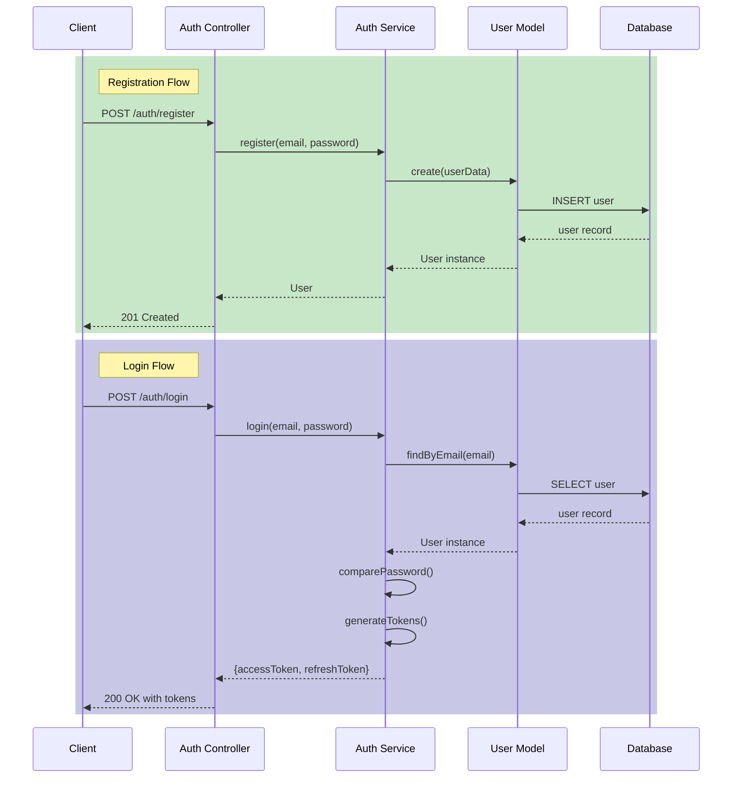

# Implementation Plan: Add User Authentication Feature

## Overview

Implement JWT-based user authentication with login, logout, and session management.

## Goal

Users can register, login, and access protected routes with JWT tokens.

## Scope

- Included: Registration, login, logout, token refresh, protected route middleware
- Excluded: OAuth integration, password reset, email verification

## Prerequisites

- Database schema for users table exists
- bcrypt and jsonwebtoken packages installed

## Sources

| Source | URL / Identifier | Description |
|--------|-----------------|-------------|
| Feature spec (Notion) | https://notion.so/team/auth-feature-spec-abc123 | Requirements and acceptance criteria for user authentication |
| Login screen design (Figma) | https://figma.com/file/xyz789/auth-screens | UI designs for login and registration forms |
| Security requirements (Jira) | PROJ-456 | Non-functional requirements for token handling and rate limiting |

## Design

### Authentication Flow



## Decisions

Clarifications and decisions made during planning:

| Topic | Decision | Rationale |
|-------|----------|-----------|
| Token storage | Access token in memory, refresh token in httpOnly cookie | Balances security and usability |
| Password requirements | Min 8 chars, at least 1 number | Matches existing validation patterns in codebase |
| Rate limiting | 5 attempts per minute for login | Prevent brute force attacks |
| Refresh token invalidation | Store in Redis with TTL | Enable logout from all devices |

## Tasks

### D1: Define API Specification

- **ID**: `a1b2c3d4-e5f6-7890-abcd-ef1234567890`
- **Category**: `documentation`
- **File(s)**: `docs/api/authentication`

#### Description

Document authentication API endpoints before implementation. This specification serves as the contract between backend and frontend development, enabling parallel work streams.

#### Details

- Define all auth endpoints (register, login, refresh, logout)
- Specify request/response schemas with examples
- Document error codes and messages
- Define authentication flow and token format

Example endpoint specification:

```
POST /api/auth/login
Request: { email: string, password: string }
Response: { accessToken: string, refreshToken: string }
Errors: 401 Invalid credentials, 429 Rate limited
```

#### Acceptance Criteria

- [ ] All endpoints documented with request/response schemas
- [ ] Error codes and messages defined for each endpoint
- [ ] Authentication flow diagram included
- [ ] Reviewed and approved by team

### B1: Create User Model

- **ID**: `b1c2d3e4-f5a6-7890-bcde-f12345678901`
- **Category**: `backend`
- **File(s)**: `src/models/user`

#### Description

Define the User model with secure password hashing. This model is the foundation for all authentication operations.

#### Details

- Fields: id, email, passwordHash, createdAt, updatedAt
- Add pre-save hook for password hashing using bcrypt (cost factor 12)
- Add method `comparePassword(plain: string): Promise<boolean>`

```typescript
interface User {
  id: string;
  email: string;
  passwordHash: string;
  createdAt: Date;
  updatedAt: Date;
}
```

#### Acceptance Criteria

- [ ] User model can be imported without errors
- [ ] Password is hashed on save (never stored in plain text)
- [ ] `comparePassword` correctly validates passwords
- [ ] Email uniqueness constraint enforced

### B2: Create Auth Service

- **ID**: `c2d3e4f5-a6b7-8901-cdef-123456789012`
- **Category**: `backend`
- **File(s)**: `src/services/auth`

#### Description

Implement authentication business logic including registration, login, token refresh, and logout. This service encapsulates all auth-related operations.

#### Details

Methods to implement:

- `register(email: string, password: string): Promise<User>`
- `login(email: string, password: string): Promise<{accessToken, refreshToken}>`
- `refreshToken(token: string): Promise<{accessToken}>`
- `logout(userId: string): Promise<void>`

Token configuration:

- Access token: JWT, 15 minute expiry
- Refresh token: JWT, 7 day expiry
- Store refresh tokens in Redis for invalidation support

#### Acceptance Criteria

- [ ] All methods implemented and exported
- [ ] Unit tests pass for all methods
- [ ] Invalid credentials return appropriate errors
- [ ] Tokens contain correct claims (userId, exp, iat)

### B3: Create Auth API

- **ID**: `d3e4f5a6-b7c8-9012-def0-123456789abc`
- **Category**: `backend`
- **File(s)**: `src/middleware/auth`, `src/controllers/auth`, `src/routes/auth`

#### Description

Implement the HTTP layer for authentication including middleware, controllers, and routes. This exposes the auth service via REST API.

#### Details

**Middleware** (`auth.middleware.ts`):
- Extract JWT from `Authorization: Bearer <token>` header
- Verify token signature and expiration
- Attach user to request context

**Controller** (`auth.controller.ts`):
- HTTP handlers for register, login, refresh, logout
- Input validation and error handling
- Set refresh token as httpOnly cookie

**Routes** (`auth.routes.ts`):
- Wire up endpoints under `/api/auth` prefix
- Apply rate limiting (5 req/min) to login endpoint

#### Acceptance Criteria

- [ ] POST /api/auth/register creates user and returns 201
- [ ] POST /api/auth/login returns tokens and sets cookie
- [ ] POST /api/auth/refresh returns new access token
- [ ] POST /api/auth/logout invalidates refresh token
- [ ] Protected routes return 401 without valid token
- [ ] Rate limiting triggers 429 after 5 attempts

### F1: Create Auth Forms

- **ID**: `e4f5a6b7-c8d9-0123-ef01-23456789abcd`
- **Category**: `frontend`
- **File(s)**: `src/components/auth`

#### Description

Implement login and registration forms with client-side validation, error handling, and loading states. These forms provide the user interface for authentication.

#### Details

**Login Form** (`LoginForm.tsx`):
- Email and password inputs
- Client-side validation (required, email format)
- Submit handler calls auth API
- Display loading spinner during submission
- Show error messages on failure
- Redirect to dashboard on success

**Registration Form** (`RegisterForm.tsx`):
- Email, password, and confirm password inputs
- Password match validation
- Password strength indicator
- Same loading/error handling as login

Use React Hook Form for form state management.

#### Acceptance Criteria

- [ ] Forms render without errors
- [ ] Validation messages display for invalid input
- [ ] Loading state shown during API call
- [ ] Error messages from API displayed to user
- [ ] Successful login redirects to dashboard
- [ ] Successful registration redirects to login

## Verification

1. Run `pnpm test` - all tests pass
2. Manual test via curl/Postman (backend):
   - Register new user
   - Login and receive tokens
   - Access protected endpoint with token
   - Refresh access token
   - Logout and verify refresh token invalid
3. Manual test via browser (frontend):
   - Submit login and registration forms
   - Verify error messages display correctly
